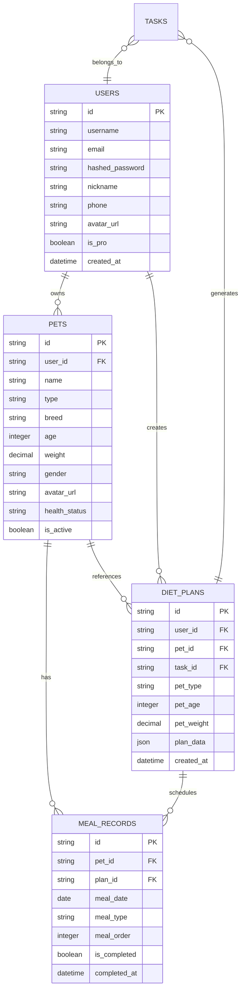
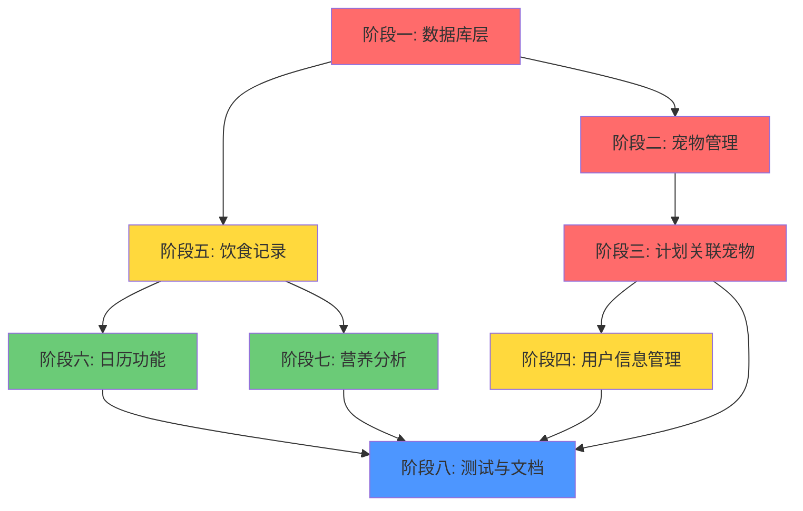

# 前后端集成开发计划

**项目**: 宠物饮食计划智能助手 - 前后端集成
**版本**: v1.0.0
**创建日期**: 2025-02-05
**状态**: 待审核

---

## 目录

1. [需求概述](#1-需求概述)
2. [现有功能分析](#2-现有功能分析)
3. [新增功能规划](#3-新增功能规划)
4. [数据库设计](#4-数据库设计)
5. [API 接口设计](#5-api-接口设计)
6. [实施步骤](#6-实施步骤)
7. [工作量估算](#7-工作量估算)
8. [依赖关系图](#8-依赖关系图)

---

## 1. 需求概述

### 1.1 项目目标

基于前端 UI/UX 需求，补充后端缺失的 API 接口，实现完整的前后端功能对接。

### 1.2 前端核心页面与对应功能

| 页面 | 核心功能 | 后端状态 |
|------|---------|---------|
| `HomePage.jsx` | 宠物选择器、今日餐食、营养进度 | 🔴 缺少宠物、餐食接口 |
| `OnboardingName.jsx` | 添加宠物（名字、头像） | 🔴 缺少宠物接口 |
| `OnboardingBasic.jsx` | 添加宠物（类型、体重、年龄） | 🔴 缺少宠物接口 |
| `OnboardingHealth.jsx` | 添加宠物（健康状况） | 🔴 缺少宠物接口 |
| `CreatePlan.jsx` | 选择宠物、生成计划 | 🟡 需要关联宠物 |
| `CalendarPage.jsx` | 月度日历、完成标记 | 🔴 缺少日历接口 |
| `AnalysisPage.jsx` | 营养分析、趋势图表 | 🔴 缺少分析接口 |
| `Profile.jsx` | 用户信息、宠物列表 | 🟡 部分缺失 |
| `ProfileEdit.jsx` | 编辑用户信息、头像 | 🟡 部分缺失 |
| `PetEdit.jsx` | 编辑宠物信息 | 🔴 缺少宠物接口 |

---

## 2. 现有功能分析

### 2.1 已实现的后端接口

| 模块 | 接口 | 状态 |
|------|------|------|
| 认证 | `POST /api/v1/auth/register` | ✅ |
| 认证 | `POST /api/v1/auth/login` | ✅ |
| 认证 | `POST /api/v1/auth/refresh` | ✅ |
| 认证 | `GET /api/v1/auth/me` | ✅ |
| 验证码 | `POST /api/v1/auth/send-code` | ✅ |
| 验证码 | `POST /api/v1/auth/verify-register` | ✅ |
| 验证码 | `POST /api/v1/auth/verify-reset-password` | ✅ |
| 验证码 | `POST /api/v1/auth/reset-password` | ✅ |
| 饮食计划 | `POST /api/v1/plans/` | ✅ |
| 饮食计划 | `POST /api/v1/plans/stream` | ✅ |
| 饮食计划 | `GET /api/v1/plans/stream?task_id=xxx` | ✅ |
| 饮食计划 | `GET /api/v1/plans/` | ✅ |
| 饮食计划 | `GET /api/v1/plans/{plan_id}` | ✅ |
| 饮食计划 | `DELETE /api/v1/plans/{plan_id}` | ✅ |
| 任务管理 | `GET /api/v1/tasks/` | ✅ |
| 任务管理 | `GET /api/v1/tasks/{task_id}` | ✅ |
| 任务管理 | `POST /api/v1/tasks/{task_id}/cancel` | ✅ |

### 2.2 现有数据库模型

| 模型 | 字段 | 关系 |
|------|------|------|
| **User** | id, username, email, hashed_password, is_active, created_at, updated_at | 1:N Task, 1:N DietPlan |
| **Task** | id, user_id, task_type, status, progress, current_node, input_data, output_data, error_message, created_at, updated_at | N:1 User |
| **DietPlan** | id, user_id, task_id, pet_type, pet_breed, pet_age, pet_weight, health_status, plan_data, created_at, updated_at | N:1 User |
| **RefreshToken** | id, user_id, token, is_revoked, expires_at, created_at | N:1 User |

### 2.3 问题分析

1. **宠物实体缺失**: 没有独立的 Pet 模型，导致无法管理多个宠物
2. **计划关联问题**: DietPlan 直接存储宠物信息，而非关联 Pet 实体
3. **餐食记录缺失**: 没有记录每日餐食完成情况的功能
4. **用户信息不完整**: 缺少昵称、头像、手机号、会员状态等字段
5. **日历/分析功能缺失**: 无法提供历史数据可视化

---

## 3. 新增功能规划

### 3.1 优先级分类

| 优先级 | 模块 | 原因 |
|--------|------|------|
| 🔴 **P0** | 宠物管理 | 前端核心功能，用户无法正常使用应用 |
| 🔴 **P0** | 计划关联宠物 | 需要调整现有数据模型 |
| 🟡 **P1** | 饮食记录 | 用户每日使用功能 |
| 🟡 **P1** | 用户信息管理 | 头像、昵称编辑 |
| 🟢 **P2** | 日历功能 | 增强用户体验 |
| 🟢 **P2** | 营养分析 | 数据可视化功能 |

---

## 4. 数据库设计

### 4.1 新增/修改表结构

#### 4.1.1 pets 表（新增）

```sql
CREATE TABLE pets (
    id VARCHAR(36) PRIMARY KEY,
    user_id VARCHAR(36) NOT NULL REFERENCES users(id) ON DELETE CASCADE,
    name VARCHAR(50) NOT NULL,
    type VARCHAR(10) NOT NULL,           -- 'cat' | 'dog'
    breed VARCHAR(100),
    age INTEGER NOT NULL,                -- 月
    weight DECIMAL(5,2) NOT NULL,       -- kg
    gender VARCHAR(10),                   -- 'male' | 'female'
    avatar_url TEXT,
    health_status TEXT,
    special_requirements TEXT,
    is_active BOOLEAN DEFAULT TRUE,        -- 是否被删除
    created_at TIMESTAMP WITH TIME ZONE DEFAULT NOW(),
    updated_at TIMESTAMP WITH TIME ZONE DEFAULT NOW(),

    INDEX idx_user_id (user_id),
    INDEX idx_user_active (user_id, is_active)
);
```

#### 4.1.2 meal_records 表（新增）

```sql
CREATE TABLE meal_records (
    id VARCHAR(36) PRIMARY KEY,
    pet_id VARCHAR(36) NOT NULL REFERENCES pets(id) ON DELETE CASCADE,
    plan_id VARCHAR(36) REFERENCES diet_plans(id) ON DELETE SET NULL,
    meal_date DATE NOT NULL,
    meal_type VARCHAR(20) NOT NULL,       -- 'breakfast' | 'lunch' | 'dinner' | 'snack'
    meal_order INTEGER NOT NULL,          -- 第几餐
    food_name VARCHAR(100),
    description TEXT,
    calories INTEGER,
    is_completed BOOLEAN DEFAULT FALSE,
    completed_at TIMESTAMP WITH TIME ZONE,
    notes TEXT,
    created_at TIMESTAMP WITH TIME ZONE DEFAULT NOW(),
    updated_at TIMESTAMP WITH TIME ZONE DEFAULT NOW(),

    INDEX idx_pet_date (pet_id, meal_date),
    INDEX idx_pet_completed (pet_id, is_completed),
    INDEX idx_meal_type (meal_type)
);
```

#### 4.1.3 users 表修改（新增字段）

```sql
ALTER TABLE users ADD COLUMN nickname VARCHAR(50);
ALTER TABLE users ADD COLUMN phone VARCHAR(20);
ALTER TABLE users ADD COLUMN avatar_url TEXT;
ALTER TABLE users ADD COLUMN is_pro BOOLEAN DEFAULT FALSE;
ALTER TABLE users ADD COLUMN plan_type VARCHAR(20);          -- 'monthly' | 'yearly'
ALTER TABLE users ADD COLUMN subscription_expired_at TIMESTAMP WITH TIME ZONE;
```

#### 4.1.4 diet_plans 表修改（新增 pet_id）

```sql
ALTER TABLE diet_plans ADD COLUMN pet_id VARCHAR(36);
ALTER TABLE diet_plans ADD CONSTRAINT fk_pet
    FOREIGN KEY (pet_id) REFERENCES pets(id) ON DELETE SET NULL;
ALTER TABLE diet_plans ADD INDEX idx_pet_id (pet_id);

-- 注意：创建计划时，优先使用 pet_id 获取宠物信息
-- 历史数据可能没有 pet_id，需要兼容处理
```

### 4.2 ER 图



---

## 5. API 接口设计

### 5.1 宠物管理模块 (P0)

#### 5.1.1 获取宠物列表

```http
GET /api/v1/pets/
Authorization: Bearer <access_token>
```

**Query:**
- `is_active`: boolean (可选) - 默认 true

**Response:**
```json
{
  "code": 0,
  "message": "获取成功",
  "data": {
    "total": 2,
    "items": [
      {
        "id": "pet_1",
        "name": "Cooper",
        "type": "dog",
        "breed": "金毛巡回犬",
        "age": 36,
        "weight": 32.5,
        "gender": "male",
        "avatar_url": "https://...",
        "health_status": "健康",
        "special_requirements": null,
        "has_plan": true,
        "created_at": "2025-01-15T00:00:00Z"
      }
    ]
  }
}
```

#### 5.1.2 创建宠物

```http
POST /api/v1/pets/
Authorization: Bearer <access_token>
Content-Type: application/json
```

**Request:**
```json
{
  "name": "Cooper",
  "type": "dog",
  "breed": "金毛巡回犬",
  "age": 36,
  "weight": 32.5,
  "gender": "male",
  "health_status": "健康",
  "special_requirements": "对鸡肉过敏"
}
```

**Response:**
```json
{
  "code": 0,
  "message": "创建成功",
  "data": {
    "id": "pet_1",
    "name": "Cooper",
    "type": "dog",
    ...
  }
}
```

#### 5.1.3 获取宠物详情

```http
GET /api/v1/pets/{pet_id}
Authorization: Bearer <access_token>
```

#### 5.1.4 更新宠物

```http
PUT /api/v1/pets/{pet_id}
Authorization: Bearer <access_token>
Content-Type: application/json
```

#### 5.1.5 删除宠物（软删除）

```http
DELETE /api/v1/pets/{pet_id}
Authorization: Bearer <access_token>
```

**Response:**
```json
{
  "code": 0,
  "message": "删除成功",
  "data": { "pet_id": "pet_1" }
}
```

#### 5.1.6 上传宠物头像

```http
POST /api/v1/pets/{pet_id}/avatar
Authorization: Bearer <access_token>
Content-Type: multipart/form-data
```

**Request:** `avatar` (file)

---

### 5.2 用户信息管理模块 (P1)

#### 5.2.1 更新用户基本信息

```http
PUT /api/v1/auth/profile
Authorization: Bearer <access_token>
Content-Type: application/json
```

**Request:**
```json
{
  "nickname": "Alex Chen",
  "phone": "13800138000"
}
```

#### 5.2.2 上传用户头像

```http
POST /api/v1/auth/avatar
Authorization: Bearer <access_token>
Content-Type: multipart/form-data
```

**Request:** `avatar` (file)

#### 5.2.3 获取订阅状态

```http
GET /api/v1/auth/subscription
Authorization: Bearer <access_token>
```

**Response:**
```json
{
  "code": 0,
  "message": "获取成功",
  "data": {
    "is_pro": true,
    "plan_type": "monthly",
    "expired_at": "2025-03-01T00:00:00Z"
  }
}
```

---

### 5.3 饮食记录模块 (P1)

#### 5.3.1 获取今日餐食

```http
GET /api/v1/meals/today?pet_id={pet_id}
Authorization: Bearer <access_token>
```

**Response:**
```json
{
  "code": 0,
  "message": "获取成功",
  "data": {
    "date": "2025-02-05",
    "meals": [
      {
        "id": "meal_1",
        "type": "breakfast",
        "name": "早晨干粮混合",
        "time": "08:00",
        "description": "鸡肉米饭配方",
        "calories": 350,
        "is_completed": false,
        "completed_at": null,
        "details": {
          "ingredients": ["鸡胸肉 100g", "糙米 50g"],
          "nutrition": { "fat": "12g", "protein": "28g", "carbs": "35g" },
          "ai_tip": "早餐提供充足能量"
        }
      },
      {
        "id": "meal_2",
        "type": "lunch",
        "name": "午餐混合",
        "time": "12:00",
        "description": "牛肉蔬菜配方",
        "calories": 400,
        "is_completed": false,
        "completed_at": null,
        "details": {
          "ingredients": ["牛肉 100g", "胡萝卜 50g"],
          "nutrition": { "fat": "15g", "protein": "30g", "carbs": "40g" },
          "ai_tip": "午餐增加蔬菜补充维生素"
        }
      },
      {
        "id": "meal_3",
        "type": "dinner",
        "name": "晚餐混合",
        "time": "18:00",
        "description": "鱼肉米饭配方",
        "calories": 430,
        "is_completed": false,
        "completed_at": null,
        "details": {
          "ingredients": ["三文鱼 100g", "西兰花 50g"],
          "nutrition": { "fat": "20g", "protein": "35g", "carbs": "45g" },
          "ai_tip": "晚餐提供优质蛋白质"
        }
      }
    ],
    "nutrition_summary": {
      "total_calories": 1180,
      "consumed_calories": 0,
      "protein": { "target": 93, "consumed": 0 },
      "fat": { "target": 47, "consumed": 0 },
      "carbs": { "target": 120, "consumed": 0 },
      "fiber": { "target": 5, "consumed": 0 }
    }
  }
}
```

#### 5.3.2 标记餐食完成

```http
POST /api/v1/meals/{meal_id}/complete
Authorization: Bearer <access_token>
```

**Response:**
```json
{
  "code": 0,
  "message": "标记成功",
  "data": {
    "meal_id": "meal_1",
    "is_completed": true,
    "completed_at": "2025-02-05T08:15:00Z"
  }
}
```

#### 5.3.3 取消餐食完成标记

```http
DELETE /api/v1/meals/{meal_id}/complete
Authorization: Bearer <access_token>
```

#### 5.3.4 获取指定日期餐食

```http
GET /api/v1/meals/date?pet_id={pet_id}&date=2025-02-05
Authorization: Bearer <access_token>
```

#### 5.3.5 获取历史饮食记录

```http
GET /api/v1/meals/history?pet_id={pet_id}&start_date=2025-01-01&end_date=2025-01-31&page=1&page_size=10
Authorization: Bearer <access_token>
```

---

### 5.4 日历功能模块 (P2)

#### 5.4.1 获取月度日历数据

```http
GET /api/v1/calendar/monthly?pet_id={pet_id}&year=2025&month=2
Authorization: Bearer <access_token>
```

**Response:**
```json
{
  "code": 0,
  "message": "获取成功",
  "data": {
    "year": 2025,
    "month": 2,
    "days": [
      {
        "date": "2025-02-01",
        "has_plan": true,
        "completion_rate": 100,
        "total_meals": 3,
        "completed_meals": 3,
        "status": "excellent"
      },
      {
        "date": "2025-02-02",
        "has_plan": true,
        "completion_rate": 67,
        "total_meals": 3,
        "completed_meals": 2,
        "status": "normal"
      },
      {
        "date": "2025-02-03",
        "has_plan": false,
        "completion_rate": 0,
        "total_meals": 0,
        "completed_meals": 0,
        "status": "none"
      }
    ]
  }
}
```

#### 5.4.2 获取周视图数据

```http
GET /api/v1/calendar/weekly?pet_id={pet_id}&start_date=2025-02-03
Authorization: Bearer <access_token>
```

---

### 5.5 营养分析模块 (P2)

#### 5.5.1 获取营养分析数据

```http
GET /api/v1/analysis/nutrition?pet_id={pet_id}&period=week
Authorization: Bearer <access_token>
```

**Query 参数:**
- `pet_id`: 宠物 ID（必需）
- `period`: 时间段 `week` | `month` | `year`（默认 week）

**Response:**
```json
{
  "code": 0,
  "message": "获取成功",
  "data": {
    "period": "week",
    "summary": {
      "avg_calories": 1150,
      "avg_completion_rate": 85,
      "calorie_trend": "stable",
      "protein_target": 650,
      "protein_consumed": 600,
      "fat_target": 330,
      "fat_consumed": 310,
      "carbs_target": 840,
      "carbs_consumed": 780
    },
    "daily_data": [
      {
        "date": "2025-02-01",
        "calories": 1180,
        "protein": 95,
        "fat": 58,
        "carbs": 120,
        "completion_rate": 100
      },
      {
        "date": "2025-02-02",
        "calories": 1130,
        "protein": 85,
        "fat": 45,
        "carbs": 115,
        "completion_rate": 67
      }
    ],
    "trend_chart": {
      "labels": ["周一", "周二", "周三", "周四", "周五", "周六", "周日"],
      "calories": [1180, 1130, 1200, 1150, 1170, 1100, 1210],
      "protein": [95, 85, 98, 92, 94, 88, 100],
      "fat": [58, 45, 62, 55, 59, 48, 65],
      "carbs": [120, 115, 125, 118, 122, 112, 130]
    },
    "ai_insights": [
      {
        "type": "positive",
        "content": "本周蛋白质摄入达标率 92%，表现良好！"
      },
      {
        "type": "suggestion",
        "content": "建议周三增加蔬菜摄入以补充纤维素"
      },
      {
        "type": "warning",
        "content": "周五脂肪摄入略高于目标，可适当调整"
      }
    ]
  }
}
```

---

### 5.6 计划关联宠物修改 (P0)

#### 5.6.1 修改创建计划请求

```http
POST /api/v1/plans/
Authorization: Bearer <access_token>
Content-Type: application/json
```

**Request (修改后):**
```json
{
  "pet_id": "pet_1",           // 新增：优先使用 pet_id
  "pet_type": "dog",             // 可选：当没有 pet_id 时使用
  "pet_breed": "金毛巡回犬",      // 可选
  "pet_age": 36,                 // 可选
  "pet_weight": 32.5,            // 可选
  "health_status": "健康"          // 可选
}
```

**逻辑:**
1. 如果提供 `pet_id`，从 Pet 表获取宠物信息
2. 如果没有 `pet_id`，使用请求中的宠物信息字段（兼容旧接口）
3. 创建计划时，保存 `pet_id` 到 DietPlan

---

## 6. 实施步骤

### 阶段一：数据库层 (P0) - 预计 0.5 天

**任务:**

1. **创建数据库迁移脚本**
   - 创建 `pets` 表
   - 创建 `meal_records` 表
   - 修改 `users` 表（新增字段）
   - 修改 `diet_plans` 表（新增 pet_id）

2. **更新 SQLAlchemy 模型**
   - 添加 `Pet` 模型
   - 添加 `MealRecord` 模型
   - 修改 `User` 模型
   - 修改 `DietPlan` 模型

**涉及文件:**
- `src/db/models.py` - 数据库模型
- `alembic/versions/xxx_add_pets_and_meals.py` - 迁移脚本

**验收标准:**
- 数据库表结构正确创建
- 关系和外键正常工作
- 历史数据兼容处理

---

### 阶段二：宠物管理模块 (P0) - 预计 1.5 天

**任务:**

1. **创建 Pydantic 模型**
   - `CreatePetRequest`
   - `UpdatePetRequest`
   - `PetResponse`
   - `PetListResponse`

2. **实现 PetService**
   - `create_pet()`
   - `get_pet()`
   - `get_pets_by_user()`
   - `update_pet()`
   - `delete_pet()`
   - `upload_avatar()`

3. **实现路由**
   - `GET /api/v1/pets/`
   - `POST /api/v1/pets/`
   - `GET /api/v1/pets/{pet_id}`
   - `PUT /api/v1/pets/{pet_id}`
   - `DELETE /api/v1/pets/{pet_id}`
   - `POST /api/v1/pets/{pet_id}/avatar`

4. **文件上传处理**
   - 支持头像上传
   - 返回可访问的 URL

**涉及文件:**
- `src/api/models/request.py` - 新增请求模型
- `src/api/models/response.py` - 新增响应模型
- `src/api/services/pet_service.py` - 新建
- `src/api/routes/pets.py` - 新建
- `src/api/main.py` - 注册路由

**验收标准:**
- 所有接口可正常调用
- CRUD 操作正确
- 头像上传成功
- 权限验证（只能操作自己的宠物）

---

### 阶段三：计划关联宠物 (P0) - 预计 0.5 天

**任务:**

1. **修改 CreatePlanRequest**
   - 新增 `pet_id` 字段（可选）

2. **修改 PlanService**
   - 创建计划时，如果提供 `pet_id`，从 Pet 表获取宠物信息
   - 保存 `pet_id` 到 DietPlan

3. **修改返回数据**
   - `GET /api/v1/pets/` 返回 `has_plan` 字段

**涉及文件:**
- `src/api/models/request.py`
- `src/api/services/plan_service.py`
- `src/api/services/pet_service.py`

**验收标准:**
- 可以通过 `pet_id` 创建计划
- 计划正确关联到宠物
- 兼容旧接口（不提供 pet_id）

---

### 阶段四：用户信息管理 (P1) - 预计 0.5 天

**任务:**

1. **创建 Pydantic 模型**
   - `UpdateProfileRequest`
   - `UploadAvatarResponse`
   - `SubscriptionResponse`

2. **实现接口**
   - `PUT /api/v1/auth/profile`
   - `POST /api/v1/auth/avatar`
   - `GET /api/v1/auth/subscription`

3. **文件存储**
   - 配置头像存储路径
   - 生成可访问 URL

**涉及文件:**
- `src/api/models/request.py`
- `src/api/models/response.py`
- `src/api/routes/auth.py`
- `src/api/services/auth_service.py`

**验收标准:**
- 可以更新昵称和手机号
- 可以上传和更换头像
- 可以获取会员状态

---

### 阶段五：饮食记录模块 (P1) - 预计 1.5 天

**任务:**

1. **创建 Pydantic 模型**
   - `MealResponse`
   - `TodayMealsResponse`
   - `MealHistoryResponse`
   - `NutritionSummary`

2. **实现 MealService**
   - `get_today_meals()`
   - `get_meals_by_date()`
   - `complete_meal()`
   - `uncomplete_meal()`
   - `get_meal_history()`
   - `get_nutrition_summary()`

3. **从 DietPlan 生成 MealRecords**
   - 创建计划时，自动生成餐食记录
   - 按周重复生成（30天）

4. **实现路由**
   - `GET /api/v1/meals/today`
   - `GET /api/v1/meals/date`
   - `POST /api/v1/meals/{meal_id}/complete`
   - `DELETE /api/v1/meals/{meal_id}/complete`
   - `GET /api/v1/meals/history`

**涉及文件:**
- `src/api/models/request.py`
- `src/api/models/response.py`
- `src/api/services/meal_service.py` - 新建
- `src/api/routes/meals.py` - 新建
- `src/api/main.py` - 注册路由

**验收标准:**
- 获取今日餐食正常
- 标记完成/取消正常
- 营养统计准确
- 历史记录查询正常

---

### 阶段六：日历功能模块 (P2) - 预计 1 天

**任务:**

1. **创建 Pydantic 模型**
   - `CalendarDayResponse`
   - `MonthlyCalendarResponse`
   - `WeeklyCalendarResponse`

2. **实现 CalendarService**
   - `get_monthly_calendar()`
   - `get_weekly_calendar()`

3. **实现路由**
   - `GET /api/v1/calendar/monthly`
   - `GET /api/v1/calendar/weekly`

**涉及文件:**
- `src/api/models/response.py`
- `src/api/services/calendar_service.py` - 新建
- `src/api/routes/calendar.py` - 新建
- `src/api/main.py` - 注册路由

**验收标准:**
- 月度日历数据正确
- 完成率计算准确
- 周视图数据正确

---

### 阶段七：营养分析模块 (P2) - 预计 1 天

**任务:**

1. **创建 Pydantic 模型**
   - `NutritionAnalysisResponse`
   - `DailyNutritionData`
   - `TrendChart`
   - `AIInsight`

2. **实现 AnalysisService**
   - `get_nutrition_analysis()`
   - `calculate_nutrition_summary()`
   - `generate_trend_chart()`
   - `generate_ai_insights()`

3. **实现路由**
   - `GET /api/v1/analysis/nutrition`

**涉及文件:**
- `src/api/models/response.py`
- `src/api/services/analysis_service.py` - 新建
- `src/api/routes/analysis.py` - 新建
- `src/api/main.py` - 注册路由

**验收标准:**
- 营养数据统计准确
- 趋势图数据正确
- AI 建议生成合理

---

### 阶段八：测试与文档 (预计 1 天)

**任务:**

1. **编写单元测试**
   - 测试 PetService
   - 测试 MealService
   - 测试 CalendarService
   - 测试 AnalysisService

2. **编写集成测试**
   - 完整的宠物管理流程
   - 完整的餐食记录流程

3. **更新 API 文档**
   - 补充新增接口说明
   - 更新示例代码

**涉及文件:**
- `tests/test_services/test_pet_service.py` - 新建
- `tests/test_services/test_meal_service.py` - 新建
- `tests/test_services/test_calendar_service.py` - 新建
- `tests/test_services/test_analysis_service.py` - 新建
- `docs/API_REFERENCE.md` - 更新

**验收标准:**
- 测试覆盖率 > 70%
- 所有测试通过
- API 文档完整

---

## 7. 工作量估算

| 阶段 | 任务 | 预计时间 | 累计时间 |
|------|------|---------|---------|
| 阶段一 | 数据库层 (P0) | 0.5 天 | 0.5 天 |
| 阶段二 | 宠物管理模块 (P0) | 1.5 天 | 2 天 |
| 阶段三 | 计划关联宠物 (P0) | 0.5 天 | 2.5 天 |
| 阶段四 | 用户信息管理 (P1) | 0.5 天 | 3 天 |
| 阶段五 | 饮食记录模块 (P1) | 1.5 天 | 4.5 天 |
| 阶段六 | 日历功能模块 (P2) | 1 天 | 5.5 天 |
| 阶段七 | 营养分析模块 (P2) | 1 天 | 6.5 天 |
| 阶段八 | 测试与文档 | 1 天 | 7.5 天 |

**总计**: 约 **7.5 个工作日**（1.5 周）

### 分阶段交付

| 里程碑 | 阶段 | 交付内容 | 时间 |
|--------|------|---------|------|
| **MVP 可用** | 阶段一至三 | 宠物管理、计划关联宠物 | 2.5 天 |
| **核心功能** | 阶段四至五 | 用户信息管理、饮食记录 | 4.5 天 |
| **完整功能** | 阶段六至八 | 日历、分析、测试文档 | 7.5 天 |

---

## 8. 依赖关系图



### 依赖说明

- **阶段一 → 所有后续阶段**: 数据库表结构是所有功能的基础
- **阶段二 → 阶段三**: 计划关联宠物需要先有宠物管理功能
- **阶段五 → 阶段六/七**: 日历和分析依赖餐食记录数据
- **所有阶段 → 阶段八**: 测试和文档需要所有功能完成

---

## 附录 A：错误码定义

| 错误码 | 说明 | HTTP 状态码 |
|-------|------|-----------|
| 0 | 成功 | 200 |
| 1001 | 用户名已存在 | 409 |
| 1002 | 邮箱已存在 | 409 |
| 1003 | 用户名或密码错误 | 401 |
| 1004 | Token 无效或已过期 | 401 |
| 1005 | 刷新 Token 失败 | 401 |
| 2001 | 任务不存在 | 404 |
| 2002 | 任务已被取消 | 400 |
| 2003 | 任务执行失败 | 500 |
| 3001 | 宠物不存在 | 404 |
| 3002 | 无权操作该宠物 | 403 |
| 3003 | 宠物数量已达上限 | 400 |
| 4001 | 餐食记录不存在 | 404 |
| 4002 | 该日期没有计划 | 404 |
| 5001 | 文件上传失败 | 400 |
| 5002 | 不支持的文件类型 | 400 |
| 4999 | 内部服务器错误 | 500 |

---

## 附录 B：文件上传配置

### B.1 支持的文件类型

| 用途 | 支持类型 | 最大大小 |
|------|---------|---------|
| 用户头像 | image/jpeg, image/png, image/webp | 2 MB |
| 宠物头像 | image/jpeg, image/png, image/webp | 2 MB |

### B.2 存储方案

**开发环境**: 本地文件系统
- 路径: `uploads/avatars/`
- URL 前缀: `/static/uploads/`

**生产环境**: 建议使用 OSS
- 阿里云 OSS
- 腾讯云 COS
- AWS S3

---

## 附录 C：AI 洞察生成规则

### C.1 正面评价 (positive)

- 完成率 >= 90%
- 营养摄入达标率 >= 85%

### C.2 建议改进 (suggestion)

- 完成率 70% - 89%
- 某一营养素偏差 > 20%

### C.3 警告提示 (warning)

- 完成率 < 70%
- 连续多日未记录
- 营养摄入严重不均衡

---

**文档版本**: v1.0.0
**最后更新**: 2025-02-05
**维护者**: AI 规划专家
