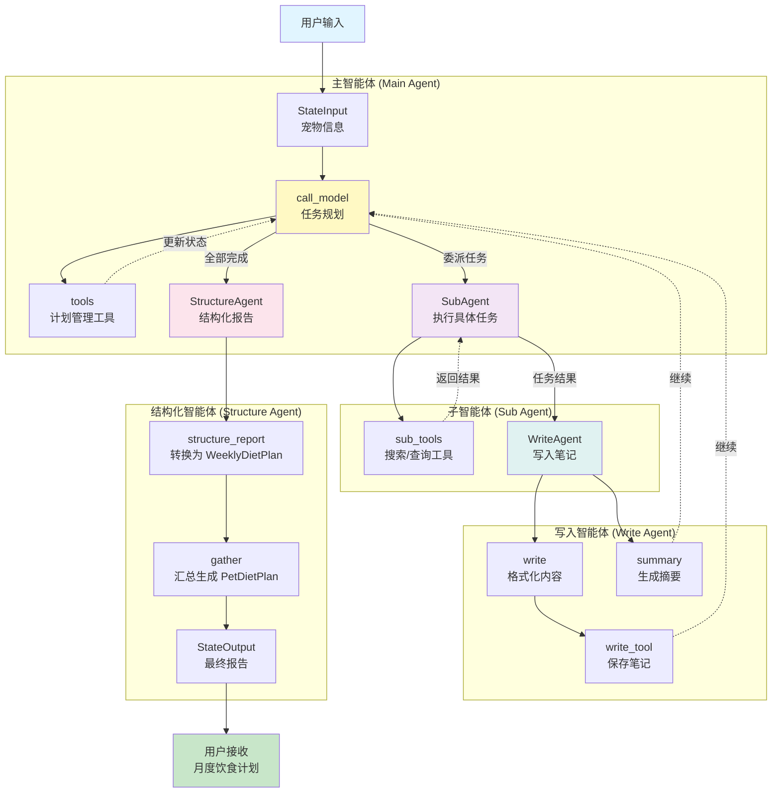
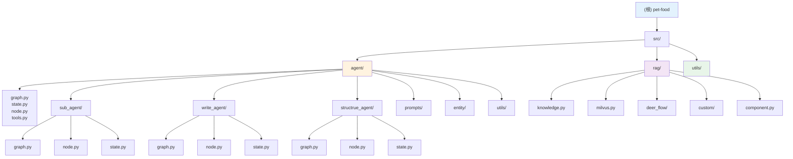

# CLAUDE.md

This file provides guidance to Claude Code (claude.ai/code) when working with code in this repository.

## 变更记录 (Changelog)

### 2025-02-04
- 添加 FastAPI RESTful API 层（认证、验证码、任务管理）
- 添加 PostgreSQL + Redis 数据库层
- 实现完整的测试套件
- 添加 Docker 部署配置
- 创建阶段性总结文档 (docs/PHASE_SUMMARY.md)
- 更新认证流程文档（包含邮箱验证码和密码重置）

### 2025-01-29
- 初始化完整的项目架构文档
- 添加多智能体系统架构图
- 创建模块级文档（agent、rag）
- 生成 .claude/index.json 索引文件
- 完成代码扫描和覆盖率分析

---

## 项目概述

这是一个基于 LangGraph 的宠物饮食计划智能助手，使用**多智能体架构**为宠物（猫、狗等）生成定制化的月度营养饮食计划。

### 项目愿景

通过智能任务分解和专业化智能体协作，为宠物主人提供科学、营养均衡的月度饮食计划，充分考虑宠物的年龄、品种、体重、健康状况等个性化因素。

---

## 架构总览

### 系统架构图



### 模块结构图



---

## 模块索引

| 模块 | 路径 | 职责 | 状态 | 文档 |
|------|------|------|------|------|
| **Agent (多智能体核心)** | `src/agent/` | 任务规划、分解与协调，多智能体协作的核心 | ✅ 核心 | [CLAUDE.md](./src/agent/CLAUDE.md) |
| **API (RESTful 接口层)** | `src/api/` | FastAPI 应用、路由、服务、中间件 | ✅ 完成 | 详见下方 API 模块说明 |
| **DB (数据持久化)** | `src/db/` | PostgreSQL + Redis 数据访问层 | ✅ 完成 | 详见下方数据库模块说明 |
| **RAG (检索增强)** | `src/rag/` | 知识库管理、向量检索、Rerank | 🔄 支持 | [CLAUDE.md](./src/rag/CLAUDE.md) |
| **Utils (工具)** | `src/utils/` | 通用工具函数 | ⚪ 辅助 | [CLAUDE.md](./src/utils/CLAUDE.md) |

---

## API 模块说明

`src/api/` 目录包含完整的 FastAPI RESTful API 实现，采用分层架构设计。

### 目录结构

```
src/api/
├── main.py                 # FastAPI 应用入口
├── config.py              # 配置管理（Pydantic Settings）
├── dependencies.py         # 依赖注入（数据库、Redis）
├── middleware/            # 中间件（CORS、日志、速率限制、异常处理）
│   ├── auth.py          # JWT 认证中间件
│   ├── logging.py       # 请求日志
│   ├── rate_limit.py   # 速率限制
│   └── exceptions.py    # 全局异常处理
├── routes/                # API 路由
│   ├── auth.py         # 认证路由（注册、登录、刷新）
│   ├── verification.py  # 验证码路由（发送、验证、重置）
│   ├── plans.py        # 饮食计划路由（创建、查询）
│   └── tasks.py        # 任务管理路由（创建、取消、流式）
├── services/              # 业务服务层
│   ├── auth_service.py    # 认证服务
│   ├── verification_service.py # 验证码服务
│   ├── email_service.py   # 邮件服务
│   ├── plan_service.py   # 饮食计划服务
│   └── task_service.py   # 任务服务
├── domain/                # 领域层
│   ├── verification.py    # 验证码实体和配置
│   └── email_template.py # 邮件模板
├── infrastructure/         # 基础设施层
│   ├── interfaces.py      # 接口定义（IEmailSender, ICodeStorage）
│   ├── redis_code_storage.py # Redis 验证码存储
│   ├── code_generator.py # 验证码生成器
│   └── email_providers/  # 邮件发送实现
│       └── smtp_email_sender.py
└── utils/                 # 工具层
    ├── security.py       # 安全工具（JWT、密码哈希）
    ├── stream.py         # SSE 流式输出
    └── errors.py         # 错误定义和转换
```

### 认证系统

采用 JWT 双 Token 机制：
- **Access Token**: 有效期 30 分钟，用于 API 认证
- **Refresh Token**: 有效期 7 天，用于刷新 Access Token

支持的认证方式：
1. **用户名密码注册** - 直接注册
2. **验证码注册** - 邮箱验证码注册（防垃圾注册）
3. **用户名/邮箱登录** - 支持两种方式
4. **Token 刷新** - 无感刷新 Access Token
5. **找回密码** - 邮箱验证码重置密码
6. **修改密码** - 登录后修改密码（验证旧密码）

### 验证码系统

使用 Redis 存储验证码，特性：
- 6 位数字验证码
- 可配置的有效期（默认 10 分钟）
- 冷却时间（默认 60 秒）
- 每日发送限制（默认 10 次）
- 最大尝试次数（默认 3 次）
- 邮件发送失败自动回滚状态

### 任务管理系统

- 异步任务执行
- 任务状态跟踪（pending/running/completed/cancelled）
- SSE 流式输出（实时推送执行过程）
- 支持任务取消

### 相关文档
- [API 配置说明](docs/API_CONFIG.md)
- [认证流程说明](docs/AUTH_FLOW.md)
- [部署指南](docs/DEPLOYMENT.md)

---

## 核心架构

### 多智能体系统

项目采用分层智能体架构，主要包含 **4 个智能体**：

#### 1. 主智能体 (Main Agent)
- **位置**: `src/agent/graph.py:build_graph_with_langgraph_studio`
- **职责**: 任务分解、计划管理和整体协调
- **工作流程**:
  1. 接收用户输入（宠物信息）
  2. 调用 `call_model` 节点使用 LLM 进行任务规划
  3. 使用 `write_plan` 工具初始化任务列表
  4. 使用 `update_plan` 工具更新任务进度
  5. 通过 `transfor_task_to_subagent` 工具将具体任务委派给子智能体
  6. 所有任务完成后，触发结构化智能体生成最终报告

#### 2. 子智能体 (Sub Agent)
- **位置**: `src/agent/sub_agent/graph.py:build_sub_agent`
- **职责**: 执行主智能体分配的具体任务
- **工作流程**:
  1. 接收任务内容（task_name）
  2. 使用 `tavily_search` 进行互联网搜索（**每任务限用一次**）
  3. 使用 `query_note` 查询历史笔记
  4. 返回任务执行结果
- **工具**: `get_weather`, `tavily_search`, `query_note`

#### 3. 写入智能体 (Write Agent)
- **位置**: `src/agent/write_agent/graph.py:build_write_agent`
- **职责**: 将子智能体的执行结果写入笔记
- **工作流程**:
  1. 并行执行两个分支：
     - `write` 分支：格式化内容并调用 `write_note` 保存
     - `summary` 分支：生成任务摘要
  2. 笔记类型：
     - `research`: 信息收集类笔记
     - `diet_plan`: 具体的某周饮食计划

#### 4. 结构化智能体 (Structure Agent)
- **位置**: `src/agent/structrue_agent/graph.py:build_structure_agent`
- **职责**: 将笔记内容转换为结构化的 `WeeklyDietPlan` 对象
- **工作流程**:
  1. 接收所有笔记（通过 `Send` 并行处理）
  2. 仅处理类型为 `diet_plan` 的笔记
  3. 使用 LLM 的结构化输出功能解析为 `WeeklyDietPlan`
  4. 将所有周计划汇总到 `gather` 节点
  5. 生成最终的 `PetDietPlan` 报告

### 状态管理

| 状态类 | 文件 | 用途 | 关键字段 |
|--------|------|------|----------|
| **StateInput** | `src/agent/state.py` | 输入状态 | `pet_information` |
| **State** | `src/agent/state.py` | 主状态 | `messages`, `plan`, `note`, `weekly_diet_plans` |
| **StateOutput** | `src/agent/state.py` | 输出状态 | `report` (PetDietPlan) |
| **SubAgentState** | `src/agent/sub_agent/state.py` | 子智能体状态 | `temp_task_messages`, `search_count` |
| **WriteState** | `src/agent/write_agent/state.py` | 写入智能体状态 | `task_messages`, `temp_write_note_messages` |
| **StructState** | `src/agent/structrue_agent/state.py` | 结构化智能体状态 | `temp_note`, `failed_reason` |

### 数据结构

核心数据结构定义在 `src/agent/utils/struct.py`，全部使用 Pydantic BaseModel：

```
PetInformation (宠物信息)
    ↓
PetDietPlan (最终报告)
    ├── pet_information: PetInformation
    ├── ai_suggestions: str
    └── pet_diet_plan: MonthlyDietPlan
            └── monthly_diet_plan: list[WeeklyDietPlan]
                    ├── oder: int (第几周)
                    ├── diet_adjustment_principle: str
                    ├── weekly_diet_plan: DailyDietPlan
                    │       └── daily_diet_plans: list[SingleMealPlan]
                    │               ├── oder: int (第几餐)
                    │               ├── time: str
                    │               ├── food_items: list[FoodItem]
                    │               └── cook_method: str
                    └── suggestions: list
```

---

## 开发环境

### 依赖管理

项目使用 `uv` 和 `pyproject.toml` 管理依赖：

```bash
# 安装依赖
uv pip install -e .
```

### Python 版本

要求 **Python >= 3.12**（见 `pyproject.toml`）

### 环境变量

复制 `.env.example` 到 `.env` 并配置以下 API 密钥：

| 环境变量 | 用途 | 提供商 |
|----------|------|--------|
| `DASHSCOPE_API_KEY` | 主模型/子模型 | 阿里云 DashScope |
| `DEEPSEEK_API_KEY` | 可选模型 | DeepSeek |
| `ZAI_API_KEY` | 子模型/报告模型 | ZAI |
| `MOONSHOT_API_KEY` | 可选模型 | Moonshot |
| `TAVILIY_API_KEY` | 互联网搜索 | Tavily |
| `SILICONFLOW_API_KEY` | 可选模型 | SiliconFlow |

---

## 运行项目

### 使用 LangGraph Studio（推荐）

项目配置了 `langgraph.json`，可通过 LangGraph Studio 运行：

```bash
# 启动 LangGraph Studio
langgraph dev
```

访问 LangGraph Studio UI 测试 `pet_food` 图，可视化查看多智能体执行流程。

### 直接运行

```bash
python main.py
```

---

## 核心工具函数

工具定义在 `src/agent/tools.py`：

| 工具名 | 用途 | 调用限制 | 使用的智能体 |
|--------|------|----------|--------------|
| `write_plan` | 初始化计划列表 | 仅调用一次，在开始时 | 主智能体 |
| `update_plan` | 更新计划状态 | 可多次调用 | 主智能体 |
| `transfor_task_to_subagent` | 委派任务给子智能体 | 每个任务调用一次 | 主智能体 |
| `ls` | 列出所有笔记名称 | 无限制 | 主智能体 |
| `query_note` | 查询指定笔记内容 | 无限制 | 主智能体/子智能体 |
| `write_note` | 写入笔记 | 每个任务结果调用一次 | 写入智能体 |
| `update_note` | 更新现有笔记 | 按需调用 | 写入智能体 |
| `tavily_search` | 互联网搜索 | **每个子任务限用一次** | 子智能体 |
| `get_weather` | 查询天气（示例） | 无限制 | 子智能体 |

---

## 笔记管理

项目使用自定义的笔记系统（`src/agent/entity/note.py`）：

### Note 数据结构

```python
class Note(BaseModel):
    content: str  # Markdown 格式的笔记内容
    type: Literal["research", "diet_plan", "diet_plan_summary"]
```

### 笔记类型

- **`research`**: 信息收集类笔记（如宠物营养需求、食材研究）
- **`diet_plan`**: 具体的某周饮食计划（使用固定模板格式）
- **`diet_plan_summary`**: 饮食计划摘要

### 饮食计划模板

参见 `src/agent/prompts/prompt.py` 中的 `SUBAGENT_PROMPT`，包含：
- 饮食原则
- 每日食谱（统一执行7天）
- 每餐详情（食材、烹饪方式、营养素含量）
- 每日总营养素
- 特别说明
- 配套建议

---

## RAG 集成

`src/rag/` 目录包含 RAG（检索增强生成）相关代码：

### 模块组成

| 模块 | 文件 | 功能 |
|------|------|------|
| **知识库管理** | `knowledge.py` | 加载 Markdown 文档，支持按标题分割 |
| **向量数据库** | `milvus.py` | Milvus 集成，混合检索（dense + sparse + BM25） |
| **DeerFlow** | `deer_flow/` | 自定义检索器 |
| **自定义组件** | `custom/` | LangChain 自定义组件 |
| **Embedding** | `component.py` | Dashscope Embedding 封装 |

### 检索策略

- **混合检索**: 密集向量（dense）+ 稀疏向量（sparse）+ BM25 全文检索
- **权重配置**: dense 0.6 + sparse 0.4
- **Rerank**: DashScope Rerank 模型重排序
- **中文分词**: 使用 jieba 分词器

---

## 提示词

核心提示词定义在 `src/agent/prompts/prompt.py`:

| 提示词 | 用途 | 使用的智能体 | 关键内容 |
|--------|------|--------------|----------|
| `PLAN_MODEL_PROMPT` | 主智能体系统提示 | 主智能体 | 任务分解准则、宠物信息、委派策略 |
| `SUBAGENT_PROMPT` | 子智能体任务执行提示 | 子智能体 | 任务上下文、历史查询、搜索限制、饮食计划模板 |
| `WRITE_PROMPT` | 笔记写入提示 | 写入智能体 | 格式化指令、类型区分 |
| `SUMMARY_PROMPT` | 任务摘要提示 | 写入智能体 | 简洁摘要要求 |
| `report_prompt` | 报告生成提示 | 结构化智能体 | 结构化输出指令 |

---

## 重要约束

### 1. 计划管理
- ✅ 必须首先使用 `write_plan` 工具初始化任务列表
- ✅ 每完成一个任务都要及时使用 `update_plan` 更新状态
- ❌ 不能跳过初始化直接更新计划

### 2. 任务执行
- ✅ 主智能体不直接执行任务，只负责委派给子智能体
- ✅ 每个任务都必须实际执行，不能仅调用工具
- ✅ 子智能体结果会保存到笔记中

### 3. 搜索限制
- ⚠️ `tavily_search` 在**每个子任务中仅可调用一次**
- 💡 请合理规划搜索策略以获取最全面的信息

### 4. 笔记类型
- `diet_plan`: 确切的某周饮食计划（使用固定模板）
- `research`: 其余所有信息收集类笔记

### 5. 月度计划结构
- 月度计划分为 **4 周**
- 每周内饮食统一（方便采购食材）
- 各周之间计划不同（营养均衡）

### 6. 营养要素要求
- ✅ 必须包含宏量营养素（蛋白质、脂肪、碳水化合物、膳食纤维）
- ✅ 必须包含微量营养素（维生素A/C/D、钙、铁、钠、钾、胆固醇等）
- ✅ 必须包含具体数值和单位

---

## 代码修改注意事项

### 修改状态结构
```python
# 同步更新三个类
class StateInput(MessagesState):
    # 新增输入字段

class StateOutput(StateInput):
    # 新增输出字段

class State(MessagesState, PlanStateMixin, NoteStateMixin):
    # 新增状态字段
```

### 新增工具
1. 在 `src/agent/tools.py` 定义工具函数
2. 在对应节点的 `bind_tools` 中注册
3. 更新 `ToolNode` 的工具列表
4. 在提示词中添加工具使用说明

### 修改数据结构
- 更新 `src/agent/utils/struct.py` 中的 Pydantic 模型
- 确保字段类型和描述准确
- 同步更新相关的状态引用

### 修改提示词
- 提示词修改需保证与工具定义一致
- 测试 LLM 是否能正确理解和使用工具
- 验证输出格式是否符合预期

---

## AI 使用指引

### 如何开始开发

1. **理解多智能体协作流程**
   - 阅读 `src/agent/graph.py` 了解整体图结构
   - 阅读 `src/agent/node.py` 了解节点间的消息流转

2. **修改任务规划逻辑**
   - 修改 `src/agent/prompts/prompt.py` 中的 `PLAN_MODEL_PROMPT`
   - 调整 `call_model` 节点的工具绑定

3. **新增子智能体功能**
   - 在 `src/agent/tools.py` 添加新工具
   - 在 `src/agent/sub_agent/node.py` 中绑定工具
   - 更新 `SUBAGENT_PROMPT` 提示词

4. **调整报告格式**
   - 修改 `src/agent/utils/struct.py` 中的数据结构
   - 更新 `structure_report` 节点的解析逻辑
   - 调整 `SUBAGENT_PROMPT` 中的模板

### 常见问题排查

| 问题 | 可能原因 | 解决方案 |
|------|----------|----------|
| 主智能体不委派任务 | 提示词不清晰 | 检查 `PLAN_MODEL_PROMPT` 是否强调委派 |
| 子智能体多次搜索 | 工具调用未限制 | 检查 `SUBAGENT_PROMPT` 是否明确搜索限制 |
| 结构化解析失败 | 笔记格式不规范 | 检查饮食计划是否符合模板 |
| 笔记未保存 | 工具节点未正确配置 | 检查 `write_tool` 节点连接 |

---

## 相关文件清单

### 核心文件

- `langgraph.json` - LangGraph 配置文件
- `pyproject.toml` - 项目依赖配置
- `.env.example` - 环境变量模板
- `main.py` - 项目入口

### Agent 模块

- `src/agent/graph.py` - 主图构建
- `src/agent/state.py` - 状态定义
- `src/agent/node.py` - 节点实现（call_model, gather, tool_node）
- `src/agent/tools.py` - 工具定义
- `src/agent/prompts/prompt.py` - 提示词
- `src/agent/utils/struct.py` - 数据结构
- `src/agent/utils/context.py` - 运行时上下文
- `src/agent/entity/note.py` - 笔记实体

### 子模块

- `src/agent/sub_agent/` - 子智能体
- `src/agent/write_agent/` - 写入智能体
- `src/agent/structrue_agent/` - 结构化智能体

### RAG 模块

- `src/rag/knowledge.py` - 知识库管理
- `src/rag/milvus.py` - Milvus 集成
- `src/rag/component.py` - Embedding 组件
- `src/rag/deer_flow/` - DeerFlow 检索器
- `src/rag/custom/` - 自定义 LangChain 组件

---

## Git 信息

项目使用 Git 版本管理：
- **主分支**: `master`
- **最近提交**: 宠物食品助手的初始化和配置
- **工作目录**: `E:\WorkProject\pet-food`

---

## 下一步建议

基于代码扫描结果，建议优先考虑以下改进：

1. **测试覆盖**
   - 添加 `tests/` 目录
   - 编写单元测试（pytest）
   - 添加集成测试（多智能体协作流程）

2. **文档完善**
   - 创建 `README.md` 项目说明
   - 添加 API 文档（Sphinx/MkDocs）
   - 补充使用示例和最佳实践

3. **代码优化**
   - 深入分析 `src/rag/deer_flow/` 自定义检索器
   - 深入分析 `src/rag/custom/` LangChain 组件
   - 考虑添加错误处理和重试机制
   - 添加日志记录（loguru/logging）

4. **功能增强**
   - 支持更多宠物类型
   - 添加饮食计划导出功能（PDF/Excel）
   - 集成更多营养数据库
   - 添加用户反馈机制

---

## 变更记录 (Changelog)

### 2025-01-30
- ✅ 添加完整的 FastAPI RESTful API 层
- ✅ 实现 JWT 认证系统（Access Token + Refresh Token）
- ✅ 实现任务管理系统（异步执行、状态跟踪）
- ✅ 实现 SSE 流式输出（LangGraph 执行过程实时推送）
- ✅ 添加数据库层（PostgreSQL + Redis）
- ✅ 添加中间件（日志、速率限制、异常处理）
- ✅ 添加完整的单元测试和集成测试
- ✅ 添加 Docker 部署配置（开发/生产环境）
- ✅ 添加 Nginx 反向代理配置
- ✅ 创建完整的 API 文档（认证流程、部署指南）
