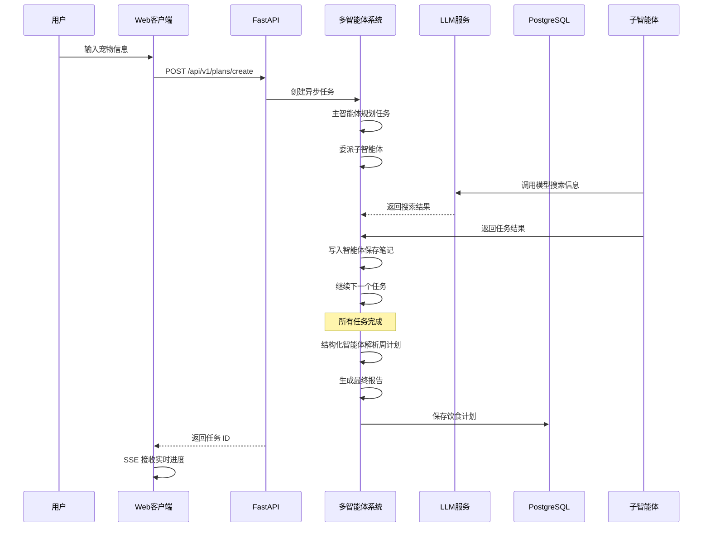
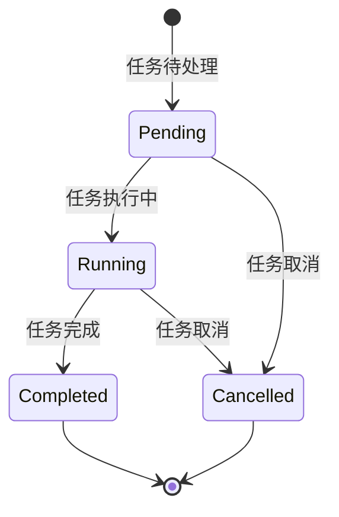
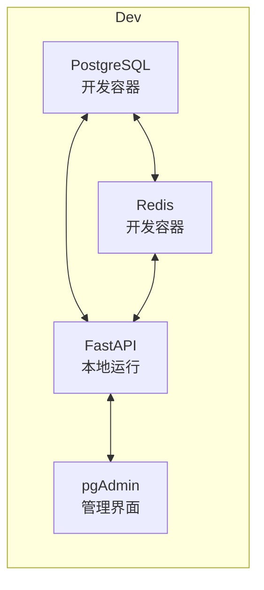
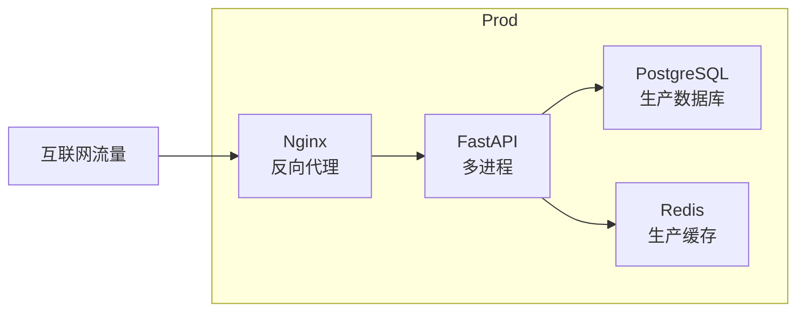
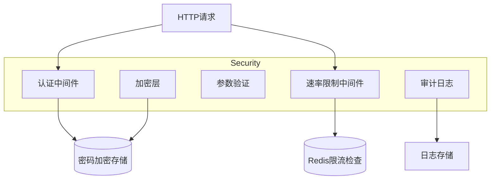

# 系统架构图

本文档描述宠物饮食计划智能助手的完整系统架构。

---

## 整体架构

```mermaid
graph TB
    subgraph Client["客户端层"]
        Web[Web 界面]
        Mobile[移动端]
        API[API 调用]

    subgraph API["FastAPI 层"]
        Router[路由层]
        Middleware[中间件层]
        Services[服务层]
        Domain[领域层]
        Infra[基础设施层]

    subgraph Data["数据持久化层"]
        PG[PostgreSQL<br/>用户/计划/任务]
        Redis[Redis<br/>验证码/Session/限流]

    subgraph Agent["LangGraph 多智能体层"]
        Main[主智能体<br/>任务规划]
        Sub[子智能体<br/>任务执行]
        Write[写入智能体<br/>笔记管理]
        Struct[结构化智能体<br/>数据解析]
        Tools[工具系统]

    subgraph LLM["LLM 服务"]
        DashScope[DashScope<br/>主模型/子模型]
        ZAI[ZAI<br/>子模型/报告]
        DeepSeek[DeepSeek<br/>可选]
        Tavily[Tavily<br/>搜索]

    Web --> API
    Mobile --> API
    API --> Data

    API --> Agent
    Agent --> LLM

    classDef router fill:#e1f5ff,stroke:#333,color:#333
    classDef middleware fill:#fff3e0,stroke:#333,color:#333
    classDef services fill:#e8f5e9,stroke:#333,color:#333
    classDef domain fill:#f3e5f5,stroke:#333,color:#333
    classDef infra fill:#e0f2f1,stroke:#333,color:#333

    classDef pg fill:#336791,stroke:#333,color:#fff
    classDef redis fill:#dc382d,stroke:#333,color:#fff

    classDef main fill:#fff9c4,stroke:#333,color:#e65100
    classDef sub fill:#f3e5f5,stroke:#333,color:#e65100
    classDef write fill:#e0f2f1,stroke:#333,color:#e65100
    classDef struct fill:#fce4ec,stroke:#333,color:#e65100

    classDef dashScope fill:#ff6f00,stroke:#333,color:#fff
    classDef zai fill:#ff5722,stroke:#333,color:#fff
    classDef deepseek fill:#4caf50,stroke:#333,color:#fff
    classDef tavily fill:#1db954,stroke:#333,color:#fff
```

---

## 请求流程图

### 用户注册流程

```mermaid
sequenceDiagram
    participant User as 用户
    participant Web as Web客户端
    participant API as FastAPI
    participant SMTP as 邮件服务
    participant Redis as Redis缓存
    participant DB as PostgreSQL

    User->>Web: 输入注册信息
    Web->>API: POST /api/v1/auth/send-code

    API->>SMTP: 发送验证码
    SMTP->>User: 邮箱收到验证码
    User->>Web: 输入验证码

    Web->>API: POST /api/v1/auth/verify-register
    API->>Redis: 验证验证码

    API->>Redis: 检查用户名/邮箱唯一性
    API->>DB: 查询用户是否存在

    alt 用户已存在
        API-->>Web: 返回 404/409
    else 用户可用
        API->>DB: 创建用户记录
        API->>Redis: 生成 Token
        API-->>Web: 返回 0 + 用户信息 + Token
```

### 用户登录流程

```mermaid
sequenceDiagram
    participant User as 用户
    participant Web as Web客户端
    participant API as FastAPI
    participant Redis as Redis缓存
    participant DB as PostgreSQL

    User->>Web: 输入用户名/密码
    Web->>API: POST /api/v1/auth/login

    API->>DB: 查询用户信息
    API->>Redis: 查询验证状态

    alt 用户不存在或密码错误
        API-->>Web: 返回 401
    else 认证成功
        API->>Redis: 生成 Access + Refresh Token
        API-->>Web: 返回 0 + Token
```

### 饮食计划创建流程



### 找回密码流程

```mermaid
sequenceDiagram
    participant User as 用户
    participant Web as Web客户端
    participant API as FastAPI
    participant SMTP as 邮件服务
    participant Redis as Redis缓存
    participant DB as PostgreSQL

    User->>Web: 输入邮箱
    Web->>API: POST /api/v1/auth/password/send-code

    API->>DB: 查询邮箱是否注册

    alt 邮箱未注册
        API-->>Web: 统一返回成功（防止枚举）
    else 邮箱已注册
        API->>SMTP: 发送重置验证码
        SMTP->>User: 邮箱收到验证码
        API-->>Web: 统一返回成功

    User->>Web: 输入验证码 + 新密码
    Web->>API: POST /api/v1/auth/password/reset

    API->>Redis: 验证验证码
    API->>DB: 更新用户密码
    API->>Redis: 撤销所有 Refresh Token

    alt 验证成功
        API-->>Web: 返回 0
    else 验证失败
        API-->>Web: 返回 422
```

---

## 分层架构

### 1. 路由层 (`src/api/routes/`)

负责接收 HTTP 请求，参数验证，调用服务层。

| 路由文件 | 路径前缀 | 主要功能 |
|---------|----------|----------|
| `auth.py` | `/api/v1/auth` | 注册、登录、刷新、获取信息 |
| `verification.py` | `/api/v1/auth` | 验证码发送、验证、密码重置、密码修改 |
| `plans.py` | `/api/v1/plans` | 创建计划、查询历史、获取详情 |
| `tasks.py` | `/api/v1/tasks` | 创建任务、查询任务、取消任务、SSE 流式 |

### 2. 服务层 (`src/api/services/`)

实现业务逻辑，协调领域层和基础设施层。

| 服务文件 | 主要功能 |
|---------|----------|
| `auth_service.py` | 用户认证、Token 生成和验证 |
| `verification_service.py` | 验证码生成、存储、验证 |
| `email_service.py` | 邮件发送、模板渲染 |
| `plan_service.py` | 饮食计划 CRUD 操作 |
| `task_service.py` | 任务管理、状态跟踪、SSE 推送 |

### 3. 领域层 (`src/api/domain/`)

定义业务实体和核心业务规则。

| 领域文件 | 主要功能 |
|---------|----------|
| `verification.py` | 验证码类型、配置、验证逻辑 |
| `email_template.py` | 邮件模板类型、HTML/文本渲染 |

### 4. 基础设施层 (`src/api/infrastructure/`)

提供与外部系统交互的实现。

| 基础设施文件 | 主要功能 |
|---------|----------|
| `interfaces.py` | 定义接口（IEmailSender、ICodeStorage）|
| `redis_code_storage.py` | Redis 验证码存储实现 |
| `code_generator.py` | 数字验证码生成器 |
| `email_providers/smtp_email_sender.py` | SMTP 邮件发送实现 |

### 5. 中间件层 (`src/api/middleware/`)

提供横切关注点，如日志、认证、限流等。

| 中间件文件 | 主要功能 |
|---------|----------|
| `logging.py` | 请求日志记录 |
| `auth.py` | JWT Token 验证和用户注入 |
| `rate_limit.py` | 基于 Redis 的分布式限流 |
| `exceptions.py` | 全局异常处理和响应转换 |

---

## 数据库设计

### PostgreSQL 表结构

```mermaid
erDiagram
    User ||--o{ User ||--o{ DietPlan
    PK "id(uuid)"

    User ||--|{ RefreshToken
    PK "id(uuid)"
    FK "user_id"

    User ||--|{ Task
    PK "id(uuid)"
    FK "user_id"

    DietPlan {
        PK "id(uuid)"
        FK "user_id"
    }

    Task {
        PK "id(uuid)"
        FK "user_id"
        status "pending/running/completed/cancelled"
    }
```

### Redis 数据结构

```
验证码: email:code:{type}       # 验证码（带类型标识）
冷却时间: email:cooldown         # 冷却结束时间戳
每日计数: email:daily:{date}     # 每日发送计数
尝试计数: email:attempts:{code}  # 验证尝试次数

Session: session:{user_id}         # 用户 Session 数据
限流: rate:{ip}:{window}      # 请求计数（滑动窗口）
```

---

## 多智能体数据流

### 状态流转



### 笔记类型

```
research: 信息收集类笔记
    - 宠物营养需求研究
    - 食材营养成分分析
    - 特殊饮食注意事项

diet_plan: 具体的某周饮食计划
    - 第 N 周
    - 饮食调整原则
    - 每日食谱（7 天统一）
    - 每餐详情（食材、烹饪方式、营养素）
    - 每日总营养素
    - 特别说明
    - 配套建议

diet_plan_summary: 饮食计划摘要
```

---

## 部署架构

### 开发环境



### 生产环境



---

## 安全架构



---

## 相关文档

- [API 错误码说明](API_ERRORS.md)
- [API 配置说明](API_CONFIG.md)
- [认证流程说明](AUTH_FLOW.md)
- [部署指南](DEPLOYMENT.md)
- [阶段性总结](PHASE_SUMMARY.md)
