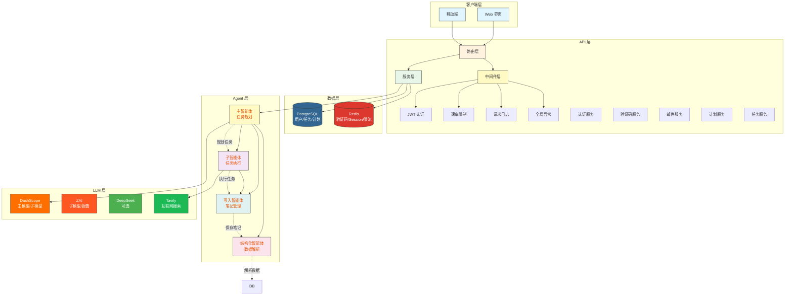
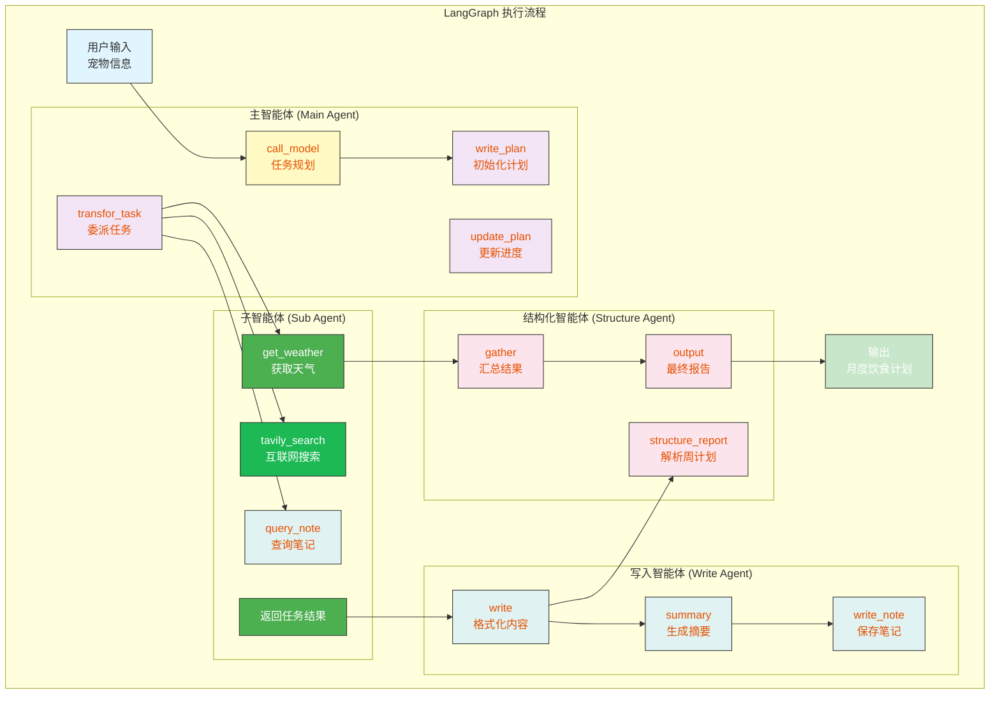
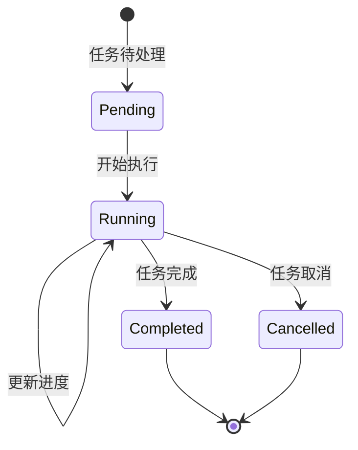

# 系统架构

> 宠物饮食计划智能助手的整体系统架构设计

---

## 目录

1. [整体架构](#整体架构)
2. [多智能体系统](#多智能体系统)
3. [数据流转](#数据流转)
4. [数据库设计](#数据库设计)

---

## 整体架构

### 分层架构图



---

## 多智能体系统

### 智能体协作图



### 智能体职责

| 智能体 | 职责 | 关键方法 |
|--------|------|----------|
| **主智能体** | 任务分解、计划管理、整体协调 | `call_model`, `write_plan`, `update_plan` |
| **子智能体** | 执行具体任务、搜索、查询 | `tavily_search`, `query_note`, `get_weather` |
| **写入智能体** | 格式化内容、保存笔记、生成摘要 | `write`, `summary`, `write_note` |
| **结构化智能体** | 解析笔记为结构化数据、汇总报告 | `structure_report`, `gather` |

---

## 数据流转

### 笔记系统

```mermaid
sequenceDiagram
    participant Main as 主智能体
    participant Sub as 子智能体
    participant Write as 写入智能体
    participant Note as 笔记系统

    Main->>Write: transfor_task_to_subagent(task_name="研究宠物营养")
    Sub->>Sub: 执行任务（搜索 + 查询）
    Sub-->>Write: 返回任务结果
    Write->>Write: write(diet_plan, content="...")
    Write->>Write: summary("第1周饮食计划")
    Write->>Note: write_note(type="diet_plan", content="...")

    Note over Main,Write: 所有子任务完成后

    Main->>Write: transfor_task_to_subagent(task_name="第2周计划")
    Main->>Main: 委派第2个任务
```

### 状态流转



---

## 数据库设计

### ER 图

```mermaid
erDiagram
    User ||--|{ User ||--|{ DietPlan
    PK "id(uuid)"
    FK "user_id"

    User ||--|{ RefreshToken
    PK "id(uuid)"
    FK "user_id"

    User ||--|{ Task
    PK "id(uuid)"
    FK "user_id"

    DietPlan }| {
        PK "id(uuid)"
        FK "user_id"
    FK "task_id"
    FK "user_id"
    FK "task_id"
    FK "user_id"
    FK "task_id"
        FK "task_id"
    FK "task_id"
    FK "task_id"
    FK "task_id"
        FK "task_id"
    FK "task_id"
    FK "task_id"
        FK "task_id"
        FK "task_id"
        FK "task_id"
        FK "task_id"
        FK "task_id"
    }

    Task {
        PK "id(uuid)"
        FK "user_id"
        status "pending/running/completed/cancelled"
        progress "0-100"
        current_node "main_agent/sub_agent/write_agent/structure_agent"
    }
```

### 表关系说明

| 表 | 说明 | 关键字段 |
|------|------|----------|
| `users` | 用户表，存储认证信息 | id, username, email, hashed_password, is_active, is_superuser |
| `tasks` | 任务表，跟踪执行状态和进度 | id, user_id, task_type, status, progress, current_node, input_data, output_data |
| `diet_plans` | 饮食计划表，存储生成的计划 | id, user_id, task_id, pet_type, pet_breed, pet_age, pet_weight, health_status, plan_data |
| `refresh_tokens` | 刷新令牌表，用于 Token 黑名单 | id, user_id, token, is_revoked, expires_at |

---

## 相关文档

- [后端开发文档](./backend/README.md)
- [前端对接指南](./frontend/README.md)
- [部署指南](./deployment/README.md)
