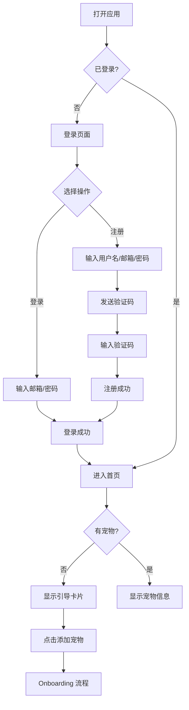
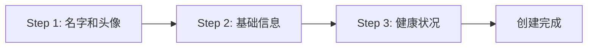
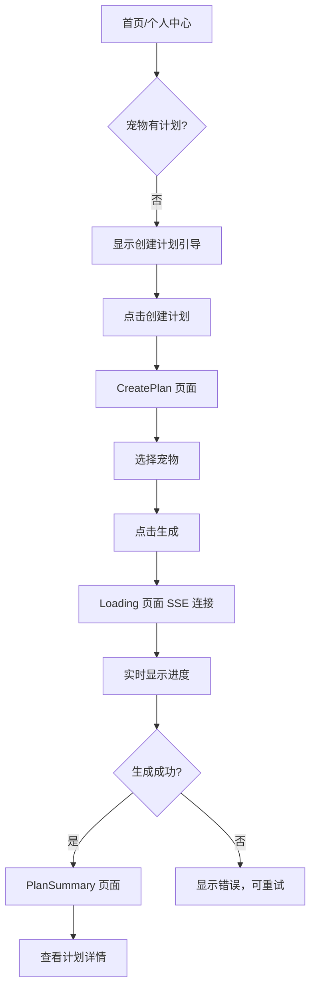
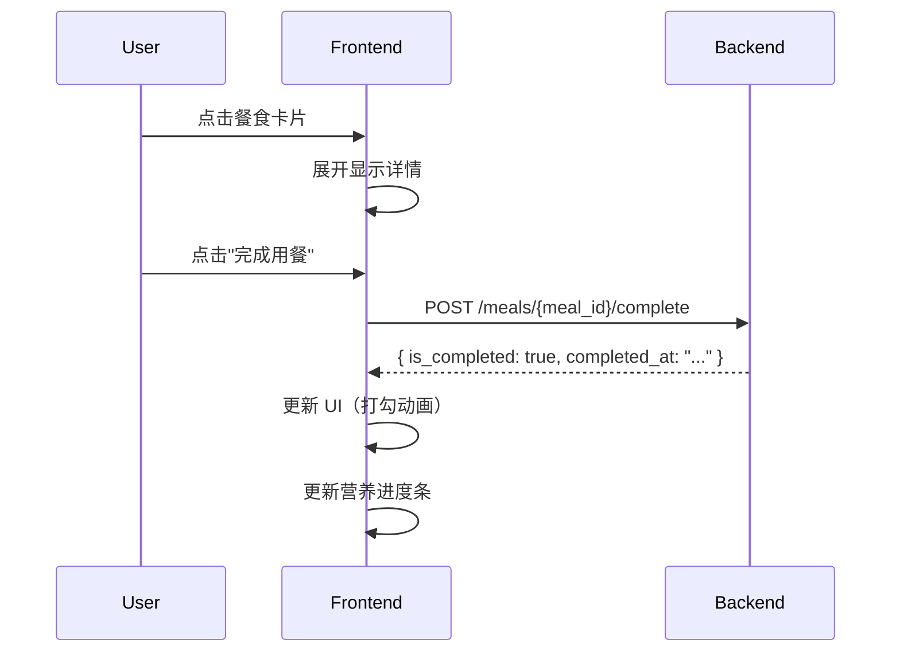
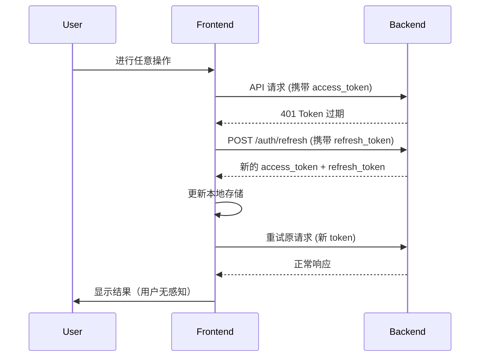

# 前端用例完整流程

> 供后端开发者理解前端应用的用户使用场景和 API 调用时机

---

## 应用架构概览

```
┌─────────────────────────────────────────────────────────────┐
│                    宠物饮食计划应用                           │
├─────────────────────────────────────────────────────────────┤
│  用户认证层    →  登录/注册/Token 管理                        │
├─────────────────────────────────────────────────────────────┤
│  宠物管理层    →  添加/编辑/删除宠物                          │
├─────────────────────────────────────────────────────────────┤
│  计划生成层    →  AI 生成饮食计划 (SSE 流式)                  │
├─────────────────────────────────────────────────────────────┤
│  日常使用层    →  查看餐食/打卡完成/营养分析                   │
└─────────────────────────────────────────────────────────────┘
```

---

## 流程一：新用户首次使用

### 完整流程图



### 步骤详解

#### 1.1 注册流程

| 步骤 | 用户操作 | 前端行为 | 需要的 API |
|------|----------|----------|------------|
| 1 | 点击"立即注册" | 跳转到注册页 | - |
| 2 | 输入用户名/邮箱/密码 | 表单验证 | - |
| 3 | 点击"发送验证码" | 调用 API，开始 60s 倒计时 | `POST /auth/send-code` |
| 4 | 输入收到的验证码 | - | - |
| 5 | 点击"注册" | 调用 API，保存 Token | `POST /auth/verify-register` |
| 6 | 自动跳转首页 | 设置用户状态 | - |

#### 1.2 登录流程

| 步骤 | 用户操作 | 前端行为 | 需要的 API |
|------|----------|----------|------------|
| 1 | 输入邮箱/密码 | 表单验证 | - |
| 2 | 点击"登录" | 调用 API，保存 Token | `POST /auth/login` |
| 3 | 自动跳转首页 | 获取用户信息 | `GET /auth/me` |

---

## 流程二：添加宠物（Onboarding）

### 完整流程图



### 三步骤详解

#### 2.1 Step 1 - OnboardingName.jsx

**页面功能：**
- 上传宠物头像（使用设备相机/相册）
- 输入宠物名字

**用户操作：**
1. 点击头像区域 → 弹出选择：拍照 / 从相册选择
2. 输入宠物名字
3. 点击"下一步"

**数据暂存：**
```javascript
{
  name: "Cooper",
  avatar: "base64://..." // 或图片 URL
}
```

#### 2.2 Step 2 - OnboardingBasic.jsx

**页面功能：**
- 选择宠物类型（猫/狗）
- 选择品种（基于类型筛选）
- 输入年龄（月）
- 输入体重（kg）
- 选择性别

**用户操作：**
1. 选择宠物类型卡片（猫/狗）
2. 下拉选择品种
3. 输入年龄和体重
4. 选择性别
5. 点击"下一步"

**数据累积：**
```javascript
{
  name: "Cooper",
  avatar: "base64://...",
  type: "dog",
  breed: "金毛巡回犬",
  age: 36,  // 月
  weight: 32,
  gender: "male"
}
```

#### 2.3 Step 3 - OnboardingHealth.jsx

**页面功能：**
- 选择/输入健康状况
- 输入特殊需求（可选）

**用户操作：**
1. 选择健康标签（健康/超重/过敏/肠胃敏感/老年犬等）
2. 输入特殊饮食需求（可选）
3. 点击"完成"

**最终提交数据：**
```javascript
{
  name: "Cooper",
  avatar: "base64://...",
  type: "dog",
  breed: "金毛巡回犬",
  age: 36,
  weight: 32,
  gender: "male",
  health_status: "健康",
  special_requirements: "对鸡肉过敏"
}
```

**需要的 API：**
| 操作 | API |
|------|-----|
| 创建宠物 | `POST /pets/` ⚠️ 缺失 |
| 上传头像 | `POST /pets/{pet_id}/avatar` ⚠️ 缺失 |

---

## 流程三：生成饮食计划

### 完整流程图



### 步骤详解

#### 3.1 CreatePlan.jsx - 创建计划页

**页面功能：**
- 显示用户所有宠物卡片
- 选择要创建计划的宠物
- 确认宠物信息

**用户操作：**
1. 查看宠物列表
2. 点击选择一个宠物
3. 确认宠物基础信息正确
4. 点击"开始生成"

**需要的 API：**
| 操作 | API |
|------|-----|
| 获取宠物列表 | `GET /pets/` ⚠️ 缺失 |

#### 3.2 Loading.jsx - 生成进度页

**页面功能：**
- 显示 AI 生成进度（SSE 实时推送）
- 显示当前执行步骤名称
- 显示执行日志
- 支持后台生成（用户可离开页面）

**SSE 事件处理：**

```javascript
// 前端接收的 SSE 事件序列示例：
1. { type: "task_created", task_id: "xxx" }
   → 保存 task_id，用于断线重连

2. { type: "node_started", node: "main_agent" }
   → 更新显示："正在分析宠物信息..."

3. { type: "node_completed", node: "main_agent", progress: 30 }
   → 进度条更新到 30%

4. { type: "tool_started", tool: "search_nutrition" }
   → 日志显示："正在搜索营养数据..."

5. { type: "tool_completed", tool: "search_nutrition" }
   → 日志显示："营养数据获取完成"

6. { type: "node_started", node: "write_agent" }
   → 更新显示："正在生成饮食计划..."

7. { type: "task_completed", task_id: "xxx", result: {...} }
   → 进度 100%，跳转到结果页
```

**断线重连场景：**
- 用户切换到其他应用 → 回来后自动重连 SSE
- 网络断开 → 恢复后通过 task_id 重连
- 使用 `GET /plans/stream?task_id=xxx` 恢复

**需要的 API：**
| 操作 | API |
|------|-----|
| 创建计划（流式） | `POST /plans/stream` ✅ |
| 恢复 SSE 连接 | `GET /plans/stream?task_id=xxx` ✅ |
| 查询任务状态 | `GET /tasks/{task_id}` ✅ |

#### 3.3 PlanSummary.jsx - 计划概览页

**页面功能：**
- 显示生成的月度计划概览
- 按周/日展示餐食安排
- 显示营养目标

**数据需求：**
```javascript
// 从 SSE result 或 API 获取的计划数据结构
{
  plan_id: "plan_xxx",
  pet_info: { name: "Cooper", ... },
  duration: "30 days",
  daily_plans: [
    {
      date: "2025-02-05",
      meals: [
        {
          type: "breakfast",
          name: "早晨干粮混合",
          time: "08:00",
          calories: 350,
          ingredients: ["鸡胸肉 100g", "糙米 50g"],
          nutrition: { protein: 28, fat: 12, carbs: 35 }
        },
        // ... lunch, dinner
      ],
      total_calories: 1180
    }
  ],
  nutrition_goals: {
    daily_calories: 1200,
    protein_ratio: 0.35,
    fat_ratio: 0.25,
    carbs_ratio: 0.40
  }
}
```

**需要的 API：**
| 操作 | API |
|------|-----|
| 获取计划详情 | `GET /plans/{plan_id}` ✅ |

---

## 流程四：日常使用

### 4.1 首页 - HomePage.jsx

**页面布局：**
```
┌────────────────────────────────────────┐
│  Header: 宠物选择器 + 通知            │
├────────────────────────────────────────┤
│  周历视图（可左右滑动查看4周）          │
├────────────────────────────────────────┤
│  今日营养进度                          │
│  ├─ 卡路里：850/1180 kcal             │
│  ├─ 蛋白质：60/95g                    │
│  └─ 脂肪：35/58g                      │
├────────────────────────────────────────┤
│  今日餐食列表                          │
│  ├─ 🌅 早餐 [已完成 ✓]                │
│  ├─ 🌞 午餐 [待完成]                  │
│  └─ 🌙 晚餐 [待完成]                  │
└────────────────────────────────────────┘
```

**用户操作与 API 调用：**

| 操作 | 前端行为 | 需要的 API |
|------|----------|------------|
| 进入首页 | 加载今日数据 | `GET /meals/today?pet_id=xxx` ⚠️ 缺失 |
| 切换宠物 | 更新宠物 ID，重新加载 | `GET /meals/today?pet_id=xxx` |
| 点击餐食卡片 | 展开查看详情 | - |
| 点击"完成" | 标记餐食已完成 | `POST /meals/{meal_id}/complete` ⚠️ 缺失 |
| 点击周历日期 | 查看该日详情 | `GET /meals/date?pet_id=xxx&date=xxx` ⚠️ 缺失 |

### 4.2 餐食完成打卡

**交互流程：**


### 4.3 日历页 - CalendarPage.jsx

**页面功能：**
- 月度日历视图
- 每日显示完成状态标记（绿点/红点/灰点）
- 点击日期查看该日详情

**需要的 API：**
| 操作 | API |
|------|-----|
| 获取月度数据 | `GET /calendar/monthly?pet_id=xxx&year=2025&month=2` ⚠️ 缺失 |
| 获取指定日期详情 | `GET /meals/date?pet_id=xxx&date=2025-02-05` ⚠️ 缺失 |

### 4.4 分析页 - AnalysisPage.jsx

**页面功能：**
- 营养摄入趋势图表
- 卡路里/蛋白质/脂肪周对比
- AI 健康建议

**需要的 API：**
| 操作 | API |
|------|-----|
| 获取分析数据 | `GET /analysis/nutrition?pet_id=xxx&period=week` ⚠️ 缺失 |

---

## 流程五：个人中心

### 5.1 Profile.jsx - 个人主页

**页面布局：**
```
┌────────────────────────────────────────┐
│  用户头像 + 昵称 + 邮箱 + PRO标识      │
├────────────────────────────────────────┤
│  我的宠物                              │
│  ├─ 🐕 Cooper - 金毛 [编辑]           │
│  ├─ 🐱 Luna - 英短 [编辑]             │
│  └─ [+ 添加宠物]                      │
└────────────────────────────────────────┘
```

**需要的 API：**
| 操作 | API |
|------|-----|
| 加载用户信息 | `GET /auth/me` ✅ |
| 加载宠物列表 | `GET /pets/` ⚠️ 缺失 |
| 删除宠物 | `DELETE /pets/{pet_id}` ⚠️ 缺失 |

### 5.2 ProfileEdit.jsx - 编辑用户信息

**页面功能：**
- 修改头像（拍照/相册）
- 修改昵称
- 修改手机号

**需要的 API：**
| 操作 | API |
|------|-----|
| 上传头像 | `POST /auth/avatar` ⚠️ 缺失 |
| 更新信息 | `PUT /auth/profile` ⚠️ 缺失 |

### 5.3 PetEdit.jsx - 编辑宠物信息

**页面功能：**
- 修改宠物头像
- 修改基础信息（名字、体重、年龄等）
- 删除宠物

**需要的 API：**
| 操作 | API |
|------|-----|
| 获取宠物详情 | `GET /pets/{pet_id}` ⚠️ 缺失 |
| 更新宠物信息 | `PUT /pets/{pet_id}` ⚠️ 缺失 |
| 上传宠物头像 | `POST /pets/{pet_id}/avatar` ⚠️ 缺失 |
| 删除宠物 | `DELETE /pets/{pet_id}` ⚠️ 缺失 |

---

## 流程六：Token 刷新与会话管理

### 自动刷新机制



### Token 存储位置

```javascript
// localStorage
{
  "access_token": "eyJhbGc...",  // 有效期 30 分钟
  "refresh_token": "eyJhbGc...", // 有效期 7 天
}
```

---

## API 调用时机汇总

| 页面 | 进入时调用 | 用户操作时调用 |
|------|------------|----------------|
| Login | - | `POST /auth/login` |
| Register | - | `POST /auth/send-code`, `POST /auth/verify-register` |
| HomePage | `GET /auth/me`, `GET /pets/`, `GET /meals/today` | `POST /meals/{id}/complete` |
| CreatePlan | `GET /pets/` | `POST /plans/stream` |
| Loading | - | SSE 事件监听 |
| PlanSummary | `GET /plans/{id}` | - |
| CalendarPage | `GET /calendar/monthly` | `GET /meals/date` |
| AnalysisPage | `GET /analysis/nutrition` | - |
| Profile | `GET /auth/me`, `GET /pets/` | `DELETE /pets/{id}` |
| ProfileEdit | - | `PUT /auth/profile`, `POST /auth/avatar` |
| PetEdit | `GET /pets/{id}` | `PUT /pets/{id}`, `DELETE /pets/{id}` |
| Onboarding | - | `POST /pets/` |

---

## 附录：页面路由

| 路由 | 页面 | 需要认证 |
|------|------|----------|
| `/login` | 登录 | ❌ |
| `/register` | 注册 | ❌ |
| `/` | 首页 | ✅ |
| `/calendar` | 日历 | ✅ |
| `/analysis` | 分析 | ✅ |
| `/profile` | 个人中心 | ✅ |
| `/profile/edit` | 编辑用户 | ✅ |
| `/pet/edit/:id` | 编辑宠物 | ✅ |
| `/plan/create` | 创建计划 | ✅ |
| `/planning` | 生成进度 | ✅ |
| `/plan/summary` | 计划概览 | ✅ |
| `/plan/details` | 计划详情 | ✅ |
| `/onboarding/step1` | 添加宠物 1 | ✅ |
| `/onboarding/step2` | 添加宠物 2 | ✅ |
| `/onboarding/step3` | 添加宠物 3 | ✅ |
