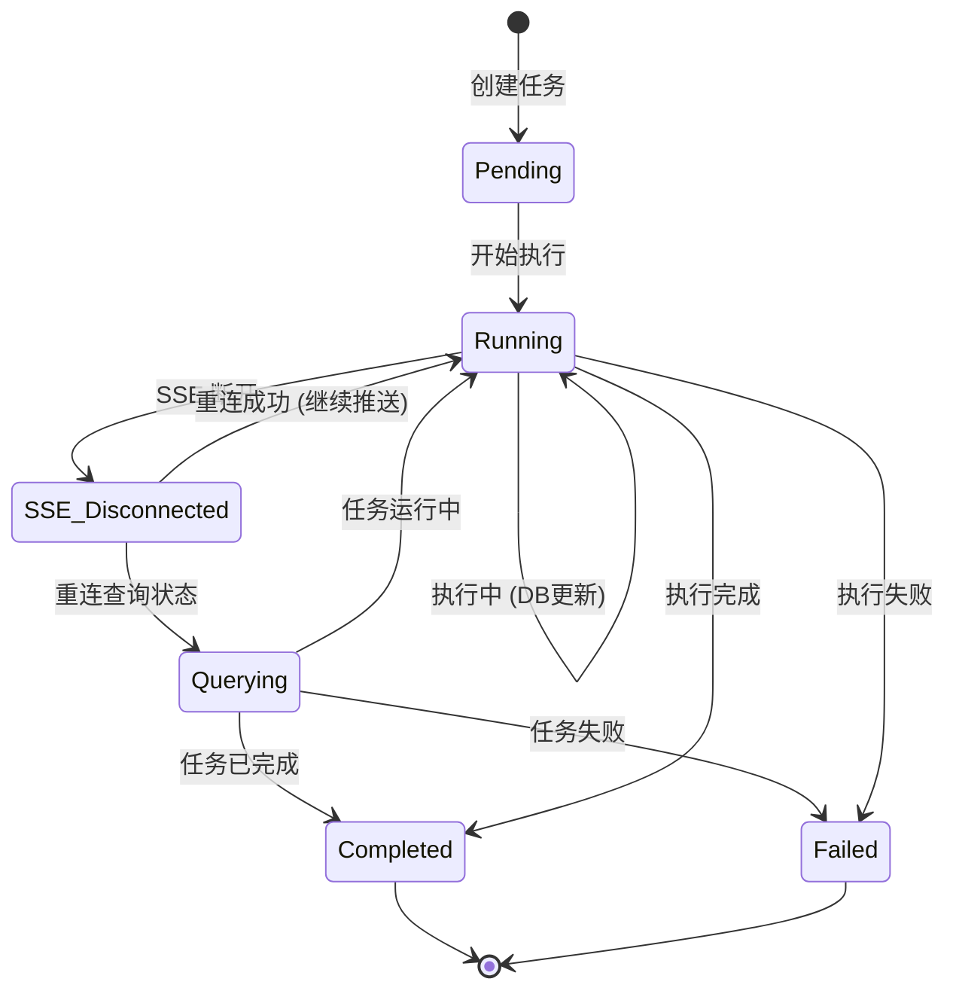
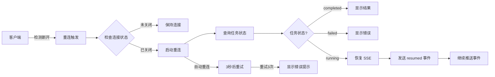

# 混合架构设计

> SSE + 数据库混合架构，支持断线重连的 Agent 任务进度追踪设计

---

## 目录

1. [架构概述](#架构概述)
2. [工作流程](#工作流程)
3. [API 端点](#api-端点)
4. [数据持久化](#数据持久化)
5. [断线重连](#断线重连)
6. [客户端实现](#客户端实现)

---

## 架构概述

### 设计目标

混合架构结合两种方案的优势：

| 特性 | 纯轮询 | SSE 流式 | 混合架构 |
|------|---------|----------|----------|
| 实时性 | ❌ 差 | ✅ 优秀 | ✅ 优秀 |
| 细粒度 | ❌ 只有进度 | ✅ 节点/工具详情 | ✅ 节点/工具详情 |
| 断线恢复 | ✅ 查询 DB | ❌ 断开即丢失 | ✅ 查询 DB + 重新 SSE |
| 长时任务 | ✅ 不依赖连接 | ⚠️ 受超时限制 | ✅ 不依赖连接 |
| 历史查询 | ✅ 支持历史 | ❌ 不支持 | ✅ 支持历史 |

### 架构图

```mermaid
graph TB
    subgraph "客户端"
        Web[Web 页面]
    end

    subgraph "API 层"
        POST[POST /plans/stream<br/>创建任务+SSE]
        GET[GET /plans/stream?task_id=xxx<br/>恢复 SSE]
        GET[GET /tasks/{task_id}<br/>查询状态]
    end

    subgraph "服务层"
        Plan[PlanService]
        Task[TaskService]
    end

    subgraph "数据层"
        DB[(PostgreSQL<br/>任务状态持久化)]
    end

    subgraph "Agent 层"
        LangGraph[LangGraph 执行]
    end

    Web -->|创建| POST
    POST -->|查询| GET
    GET -->|恢复| GET

    POST --> Plan
    Plan --> Task
    Plan --> DB

    GET --> Task
    GET --> LangGraph

    LangGraph --> Task
    Task --> DB

    Task -.推送.-> Web
```

---

## 工作流程

### 完整流程图

```mermaid
sequenceDiagram
    participant C as 客户端
    participant API as API
    participant DB as 数据库
    participant AG as Agent

    Note over C,AG: === 阶段1: 创建任务 ===
    C->>API: POST /plans/stream (创建新任务)
    API->>DB: 创建 Task (status=pending)
    API-->>C: 返回 task_id + 开始 SSE

    par SSE 实时推送
        C->>API: SSE 连接建立
        API->>AG: 开始执行图
        AG->>DB: 更新 Task (status=running, progress=0)
        AG->>API: SSE: node_started(main_agent)
        API->>DB: 更新 Task (progress=10, current_node=main_agent)
        AG->>API: SSE: node_completed(main_agent)
        AG->>API: SSE: tool_started(tavily_search)
        AG->>API: SSE: tool_completed(tavily_search)
    and 后台持续执行
        AG->>DB: 持续更新进度
    end

    Note over C,AG: === 阶段2: 连接断开 ===
    C-xAPI: 网络中断
    Note over API,AG: Agent 继续执行
        AG->>DB: 继续更新进度 (无 SSE 推送)
    end

    Note over C,AG: === 阶段3: 断线重连 ===
    C->>API: GET /tasks/{task_id} (查询状态)
    API->>DB: 查询最新状态
    API-->>C: 返回 Task (status=running, progress=65)
    C->>API: GET /plans/stream?task_id=xxx (恢复 SSE)
    API->>DB: 确认状态
    API-->>C: SSE: resumed(progress=65, current_node=write_agent)

    par 恢复 SSE 推送
        API->>AG: 继续监听事件
        AG->>API: SSE: node_completed(write_agent)
        API->>DB: 更新 Task (progress=85)
        API->>C: SSE: progress_update(progress=85)
    end

    Note over C,AG: === 阶段4: 任务完成 ===
    AG->>DB: 更新 Task (status=completed, progress=100)
    AG->>API: SSE: task_completed(result=...)
    API->>C: SSE: task_completed
        API->>DB: 保存 DietPlan
```

### 状态流转



---

## API 端点

### 1. 创建流式任务

```
POST /api/v1/plans/stream
```

**请求体：**
```json
{
  "pet_type": "dog",
  "pet_breed": "金毛巡回",
  "pet_age": 2,
  "pet_weight": 10,
  "health_status": "健康",
  "special_requirements": ""
}
```

**响应：**
- Content-Type: `text/event-stream`
- 立即返回 `task_created` 事件

---

### 2. 恢复 SSE 连接（重连）

```
GET /api/v1/plans/stream?task_id={task_id}
```

**行为：**
1. 查询任务当前状态
2. 如果已完成/失败，直接返回结果/错误
3. 如果运行中，发送 `resumed` 事件并继续推送
4. 如果 pending，等待任务开始

**重连响应示例：**
```json
// 连接恢复 - 任务运行中
{
  "type": "resumed",
  "task_id": "xxx",
  "status": "running",
  "progress": 65,
  "current_node": "write_agent"
}

// 连接恢复 - 任务已完成
{
  "type": "task_completed",
  "task_id": "xxx",
  "result": { /* 完整结果 */ }
}
```

---

### 3. 查询任务状态

```
GET /api/v1/tasks/{task_id}
```

**用于：**
- 断线后恢复时查询状态
- 前端轮询任务进度
- 获取任务结果

---

## 数据持久化

### Task 表结构

```sql
CREATE TABLE tasks (
    id VARCHAR(36) PRIMARY KEY,
    user_id VARCHAR(36) NOT NULL,
    task_type VARCHAR(50) DEFAULT 'diet_plan',
    status VARCHAR(20) DEFAULT 'pending',
    progress INTEGER DEFAULT 0,
    current_node VARCHAR(100),
    input_data JSONB NOT NULL,
    output_data JSONB,
    error_message TEXT,
    started_at TIMESTAMP WITH TIME ZONE,
    completed_at TIMESTAMP WITH TIME ZONE,
    created_at TIMESTAMP WITH TIME ZONE DEFAULT CURRENT_TIMESTAMP,
    updated_at TIMESTAMP WITH TIME ZONE DEFAULT CURRENT_TIMESTAMP
);
```

### 状态说明

| 状态 | 说明 | 进度范围 |
|------|------|----------|
| `pending` | 任务已创建，等待执行 | 0% |
| `running` | 任务执行中 | 1-99% |
| `completed` | 任务执行完成 | 100% |
| `failed` | 任务执行失败 | - |
| `cancelled` | 任务已取消 | - |

### 节点映射

| 节点 | 当前节点说明 | 预计进度 |
|------|--------------|----------|
| `main_agent` | 主智能体规划任务 | 10-30% |
| `sub_agent` | 子智能体执行任务 | 30-70% |
| `write_agent` | 写入智能体保存笔记 | 70-90% |
| `structure_agent` | 结构化智能体解析报告 | 90-99% |

---

## 断线重连

### 重连策略



### 客户端重连实现

```typescript
// src/hooks/useTaskReconnect.ts
import { useEffect, useState, useCallback } from 'react';
import { getTask } from '@/api/tasks';

interface TaskReconnectOptions {
  taskId: string;
  onProgress?: (progress: number, node: string) => void;
  onCompleted?: (result: any) => void;
  onFailed?: (error: string) => void;
  onError?: (error: Error) => void;
}

export function useTaskReconnect(options: TaskReconnectOptions) {
  const { taskId, onProgress, onCompleted, onFailed, onError } = options;

  const [reconnectAttempts, setReconnectAttempts] = useState(0);
  const maxReconnectAttempts = 3;
  const reconnectDelay = 3000; // 3 秒

  const reconnect = useCallback(async () => {
    if (reconnectAttempts >= maxReconnectAttempts) {
      onError?.(new Error('超过最大重连次数'));
      return;
    }

    setReconnectAttempts(prev => prev + 1);

    try {
      // 1. 查询任务状态
      const result = await getTask(taskId);

      if (result.code !== 0) {
        throw new Error(result.message);
      }

      const task = result.data;

      // 2. 根据状态处理
      if (task.status === 'completed') {
        onCompleted?.(task.output_data);
        return;
      }

      if (task.status === 'failed') {
        onFailed?.(task.error_message || '任务失败');
        return;
      }

      if (task.status === 'cancelled') {
        onFailed?.('任务已取消');
        return;
      }

      // 3. 如果运行中，通知进度并准备恢复 SSE
      if (task.status === 'running') {
        onProgress?.(task.progress, task.current_node || '');
        // 等待上层组件建立 SSE 连接
        return;
      }

      // 4. 如果 pending，等待
      if (task.status === 'pending') {
        onProgress?.(0, '等待开始...');
        return;
      }

    } catch (error) {
      onError?.(error as Error);
    }
  }, [taskId]);

  return { reconnect, reconnectAttempts };
}
```

---

## 客户端实现

### 完整的进度组件

```typescript
// src/components/TaskProgressWithReconnect.tsx
import { useEffect, useState } from 'react';
import { useTaskReconnect } from '@/hooks/useTaskReconnect';
import { usePlanStream } from '@/hooks/usePlanStream';
import type { TaskStatus } from '@/api/types';

export function TaskProgressWithReconnect({ taskId }: { taskId: string }) {
  const [taskStatus, setTaskStatus] = useState<TaskStatus>('pending');
  const [progress, setProgress] = useState(0);
  const [currentNode, setCurrentNode] = useState('');
  const [logs, setLogs] = useState<string[]>([]);
  const [showReconnect, setShowReconnect] = useState(false);

  // SSE 连接状态
  const [sseConnected, setSseConnected] = useState(true);
  const [sseError, setSseError] = useState(false);

  // 断线重连 Hook
  const { reconnect, reconnectAttempts } = useTaskReconnect({
    taskId,
    onProgress: (p, node) => {
      setProgress(p);
      setCurrentNode(node);
      setLogs(prev => [...prev, `进度更新: ${p}% - ${node}`]);
    },
    onCompleted: (result) => {
      setTaskStatus('completed');
      setProgress(100);
      setCurrentNode('完成');
      setLogs(prev => [...prev, '任务完成！']);
      setShowReconnect(false);
    },
    onFailed: (error) => {
      setTaskStatus('failed');
      setLogs(prev => [...prev, `任务失败: ${error}`]);
      setShowReconnect(false);
    },
    onError: (error) => {
      setLogs(prev => [...prev, `重连错误: ${error.message}`]);
      setShowReconnect(false);
    },
  });

  // SSE 流式监听
  usePlanStream(taskId, {
    onData: (event) => {
      console.log('SSE 事件:', event);

      switch (event.type) {
        case 'task_created':
          setLogs(prev => [...prev, `任务创建: ${event.task_id}`]);
          break;

        case 'resumed':
          setShowReconnect(false);
          setLogs(prev => [...prev, `连接恢复: 进度 ${event.progress}%`]);
          break;

        case 'node_started':
          setCurrentNode(event.node || '');
          setLogs(prev => [...prev, `开始: ${event.node}`]);
          break;

        case 'node_completed':
          setLogs(prev => [...prev, `完成: ${event.node}`]);
          break;

        case 'progress_update':
          setProgress(event.progress || 0);
          setCurrentNode(event.current_node || '');
          break;

        case 'task_completed':
          setTaskStatus('completed');
          setProgress(100);
          setCurrentNode('完成');
          setLogs(prev => [...prev, '任务完成！']);
          break;

        case 'error':
          setTaskStatus('failed');
          setLogs(prev => [...prev, `错误: ${event.error}`]);
          break;
      }
    },
    onError: (error) => {
      console.error('SSE 错误:', error);
      setSseError(true);
      setLogs(prev => [...prev, `SSE 错误: ${error.message}`]);

      // 3 秒后显示重连按钮
      setTimeout(() => {
        setShowReconnect(true);
        setSseConnected(false);
      }, 3000);
    },
  });

  return (
    <div className="task-progress">
      {/* 状态指示器 */}
      <div className={`status-indicator status-${taskStatus}`}>
        <div className={`dot ${sseConnected ? 'connected' : 'disconnected'}`} />
        <span>{taskStatus === 'completed' ? '已完成' : taskStatus === 'failed' ? '失败' : '进行中'}</span>
      </div>

      {/* 进度条 */}
      <div className="progress-bar">
        <div className="progress-fill" style={{ width: `${progress}%` }} />
      </div>
      <div className="progress-info">
        {progress}% - {currentNode}
      </div>

      {/* 日志区域 */}
      <div className="logs">
        {logs.map((log, i) => (
          <div key={i} className="log-item">{log}</div>
        ))}
      </div>

      {/* 重连按钮 */}
      {showReconnect && taskStatus === 'running' && (
        <button
          onClick={reconnect}
          disabled={reconnectAttempts >= 3}
          className="reconnect-button"
        >
          {reconnectAttempts >= 3
            ? '重连失败，请刷新页面'
            : `🔄 重新连接 (${3 - reconnectAttempts}/3)`}
        </button>
      )}
    </div>
  );
}
```

### 样式建议

```css
/* 任务进度组件样式 */
.task-progress {
  padding: 20px;
  max-width: 800px;
  margin: 0 auto;
}

.status-indicator {
  display: flex;
  align-items: center;
  gap: 8px;
  margin-bottom: 20px;
}

.status-indicator .dot {
  width: 12px;
  height: 12px;
  border-radius: 50%;
}

.dot.connected {
  background-color: #22c55e;
}

.dot.disconnected {
  background-color: #ef4444;
}

.progress-bar {
  height: 24px;
  background-color: #f0f0f0;
  border-radius: 12px;
  overflow: hidden;
  margin-bottom: 10px;
}

.progress-fill {
  height: 100%;
  background: linear-gradient(90deg, #3b82f6, #22c55e);
  transition: width 0.3s ease;
}

.progress-info {
  display: flex;
  justify-content: space-between;
  margin-bottom: 10px;
  font-size: 14px;
  color: #666;
}

.logs {
  background-color: #f9f9f9;
  border-radius: 8px;
  padding: 15px;
  max-height: 300px;
  overflow-y: auto;
  font-family: monospace;
  font-size: 13px;
}

.log-item {
  padding: 4px 0;
  border-bottom: 1px solid #e5e7eb;
  color: #666;
}

.log-item:last-child {
  border-bottom: none;
}

.reconnect-button {
  padding: 10px 20px;
  background-color: #3b82f6;
  color: white;
  border: none;
  border-radius: 6px;
  cursor: pointer;
  font-size: 14px;
}

.reconnect-button:hover:not(:disabled) {
  background-color: #22c55e;
}

.reconnect-button:disabled {
  background-color: #ccc;
  cursor: not-allowed;
}

/* 状态颜色 */
.status-completed {
  color: #22c55e;
}

.status-failed {
  color: #ef4444;
}
```

---

## 相关文档

- [前端对接指南](../frontend/README.md)
- [SSE 事件说明](./SSE_EVENTS.md)
- [错误码说明](./ERROR_CODES.md)
